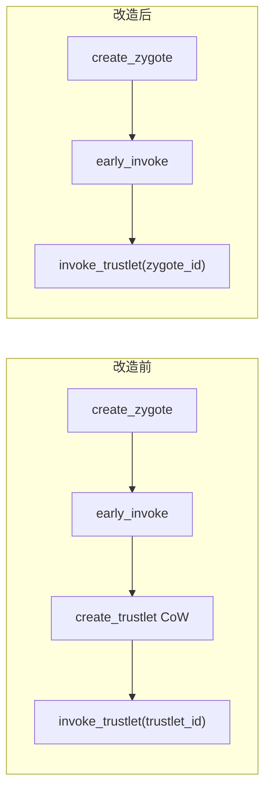
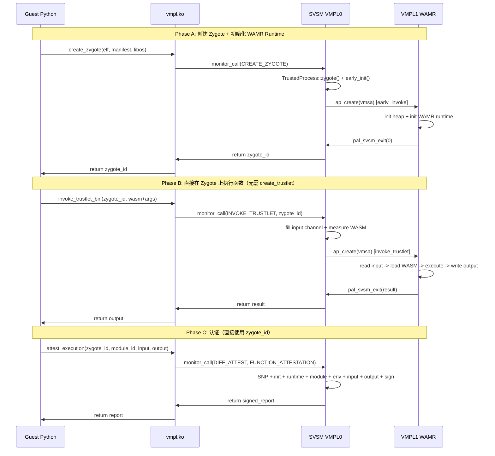

# 删除 Trustlet 进程改造计划 — 完整实施方案

## 一、改造目标与架构变化

**改造前** (Zygote + Trustlet 两级):

```
create_zygote → early_invoke(初始化 WAMR) → create_trustlet(CoW 复制) → invoke_trustlet(trustlet_id)
```

**改造后** (仅 Zygote 单级):

```
create_zygote → early_invoke(初始化 WAMR) → invoke_trustlet(zygote_id)
```


**关键前提确认**: `invoke_trustlet()` 函数 ([runtime.rs](svsm/kernel/src/process_runtime/runtime.rs) 第210-389行) **确实不区分 Zygote 和 Trustlet**。它通过 `PROCESS_STORE.get(ProcessID(id))` 获取进程，然后使用 `trustlet.context.vmsa` 和 `trustlet.context.channel` 执行。在 CoW 模式下，Zygote 经过 `early_init()` 后已拥有完整的 VMSA 和 channel，因此可以直接传入 Zygote ID。

## 二、修改文件清单（按执行顺序）

改造分为 7 层，**必须按以下顺序执行**，因为上层依赖下层的接口定义。

---

### Phase 1: SVSM 内核 (Rust) — 核心改动

#### 1.1 [process.rs](svsm/kernel/src/process_manager/process.rs) — 删除 Trustlet 枚举值、dublicate、Drop

**改动内容**:

- **删除 `TrustedProcessType::Trustlet` 枚举值** (第69行) 和 `TRUSTLET_PROCESS` 常量 (第73行)
- **删除 `dublicate()` 函数** (第218-236行) — 这是 Trustlet 创建的核心 CoW 逻辑
- **修改 `Drop` 实现** (第239-261行):
  - 删除 `TrustedProcessType::Trustlet` 分支 (第247-258行)
  - **关键修复**: 修改 `Zygote` 分支，当前注释 `// self.context is empty for zygotes` 是**错误的** — 在 CoW 模式下 `early_init()` 为 Zygote 分配了 VMSA 和 channel。需要添加 VMSA 页释放和 channel 清理:
```rust
TrustedProcessType::Zygote => {
    self.base.page_table_ref.delete(&[
        idt_trustlet().base_limit().0.into(),
        (asm_entry_trustlet_pf as u64).into(),
        unsafe { &gdt_desc as *const u8 as u64 }.into(),
        tss_trustlet().base().into(),
        gdt_trustlet().base_limit().0.into()
    ]);
    if !self.context.vmsa.is_null() {
        free_page(self.context.vmsa);
    }
    // input and output channels are deleted as part of page_table_ref
}
```


#### 1.2 [process_cow.rs](svsm/kernel/src/process_manager/process/process_cow.rs) — 删除 Trustlet 创建逻辑

**改动内容**:

- **删除 `TrustedProcess::trustlet()` 函数** (第101-125行)
- **删除 `create_trusted_process()` 中 `TrustedProcessType::Trustlet` 分支** (第169-193行)
- **修改 `delete_trusted_process()`** (第196-218行): 删除第200-212行的"检查是否有子 Trustlet"循环，简化为直接删除:
```rust
pub fn delete_trusted_process(params: &mut RequestParams) -> Result<(), SvsmReqError> {
    let process_id = ProcessID(params.rcx as usize);
    log::info!("allocated memory before deletion of {}: {}", process_id.0, process_memory::allocated_amount());
    PROCESS_STORE.delete(process_id);
    log::info!("allocated memory after deletion: {}", process_memory::allocated_amount());
    Ok(())
}
```

- **删除 `ProcessContext::init()` 函数** (第321-362行) — 这是 Trustlet 的 VMSA/页表初始化，不再需要

#### 1.3 [process_no_cow.rs](svsm/kernel/src/process_manager/process/process_no_cow.rs) — 对称修改

**改动内容** (与 process_cow.rs 对称):

- **删除 `TrustedProcess::trustlet()` 函数** (第96-117行)
- **删除 `create_trusted_process()` 中 Trustlet 分支** (第161-185行)
- **修改 `delete_trusted_process()`** (第188-210行): 同上，删除子 Trustlet 检查
- **删除 `ProcessContext::init()` 函数** (第212-268行)

#### 1.4 [call_handler.rs](svsm/kernel/src/process_manager/call_handler.rs) — 删除 Trustlet handler

**改动内容**:

- **删除常量** (第14-15行):
  ```rust
  // 删除这两行:
  const CREATE_TRUSTLET: u32 = 6;
  const DELETE_TRUSTLET: u32 = 7;
  ```

- **删除 handler 函数** (第74-79行): `create_trustlet()` 和 `delete_trustlet()`
- **删除 `monitor_call_handler` 中的分支** (第105-106行):
  ```rust
  // 删除这两行:
  CREATE_TRUSTLET => create_trustlet(params),
  DELETE_TRUSTLET => delete_trustlet(params),
  ```

- **保留**: `INVOKE_TRUSTLET` (第16行) 和 `invoke_trustlet` handler (第90-92行, 109行) — 现在传入的是 Zygote ID

#### 1.5 [runtime.rs](svsm/kernel/src/process_runtime/runtime.rs) — 基本不改

**改动内容**: 极小，仅语义优化

- `invoke_trustlet()` (第210-389行): **核心逻辑完全不变**。第249行 `PROCESS_STORE.get(ProcessID(id))` 不区分进程类型
- 可选: 将日志 `"Invoking Trustlet"` (第212行) 改为 `"Invoking Process"`
- 可选: 将函数名 `invoke_trustlet` 改为 `invoke_process`（但会影响 call_handler.rs 的调用，建议暂不改名）

#### 1.6 [monitor.rs](svsm/kernel/src/attestation/monitor.rs) — 语义重命名

**改动内容**: 极小

- `function_report()` (第306行): 变量名 `trustlet_id` → `process_id`（可选，不影响功能）
- `wasm_module_report_cold()` (第646行): 变量名 `trustlet_id` → `process_id`（可选）
- 认证常量已经是 `WAMR_RUNTIME_ATTESTATION` / `WASM_MODULE_ATTESTATION`，无需修改

#### 1.7 [mod.rs](svsm/kernel/src/process_manager/mod.rs) — 提升并发上限

**改动内容**: 1行

- 第30行: `PROCESS_STORE_SIZE` 从 `16` 改为 `32`（或更高）
  - 改造前: 每个函数占 2 个槽位 (Zygote + Trustlet)，最多 8 个并发
  - 改造后: 每个函数占 1 个槽位，最多 32 个并发

---

### Phase 2: 内核模块 (C) — Guest 侧驱动

#### 2.1 [vmpl.h](module/include/vmpl.h) — 删除 Trustlet 枚举和结构体

**改动内容**:

- **删除枚举值** (第19-20行):
  ```c
  // 删除:
  createTrustlet,
  deleteTrustlet,
  ```

- **删除 `trustlet` union 成员** (第85-89行):
  ```c
  // 删除:
  struct {
      void* trustlet_data;
      uint64_t size;
      tpid_t zygote;
  } trustlet;
  ```

- **保留**: `invokeTrustlet = 8` (第21行) — 语义变为 invoke Zygote

#### 2.2 [vmpl.c](module/src/vmpl.c) — 删除 Trustlet 函数

**改动内容**:

- **删除 `create_trustlet()` 函数** (第161-173行)
- **删除 `delete_trustlet()` 函数** (第198-208行)
- **删除 `parse_request()` 中的分支** (第346-351行):
  ```c
  // 删除:
  case createTrustlet:
      return create_trustlet(&call);
  ...
  case deleteTrustlet:
      return delete_trustlet(&call);
  ```

- **保留**: `invoke_trustlet()` 函数 (第175-188行) 和 `invokeTrustlet` case (第363-364行)

---

### Phase 3: libwallet 用户态库 (C)

#### 3.1 [trustlet.h](module/libwallet/src/trustlet.h) — 删除声明

**改动内容**:

- **删除** 第70行: `int create_trustlet(const int zygote_id, char* func);`
- **删除** 第73行: `int delete_trustlet(const int trustlet_id);`
- **保留**: `invoke_trustlet_bin()` (第72行) 和 `invoke_trustlet()` (第71行) 声明
- **删除** 第25-31行的 `INIT_CREATE_TRUSTLET` 宏（在 trustlet.c 中）

#### 3.2 [trustlet.c](module/libwallet/src/trustlet.c) — 删除创建/删除函数

**改动内容**:

- **删除 `INIT_CREATE_TRUSTLET` 宏** (第25-31行)
- **删除 `create_trustlet()` 函数** (第44-66行)
- **删除 `delete_trustlet()` 函数** (第393-402行)
- **保留**: `invoke_trustlet_bin()` (第69-222行) 和 `invoke_trustlet()` (第224-377行) — 调用者将传入 Zygote ID

#### 3.3 [attest.h](module/libwallet/src/attest.h) / [attest.c](module/libwallet/src/attest.c) — 无需修改

- `function_data` 结构体中的 `trustletId` 字段 (attest.h 第15行) 语义变为 process_id，但**不需要改名**（C 结构体改名会影响 SVSM 侧的偏移量解析）
- 所有 `process_id` 参数语义变为 Zygote ID，代码无需修改

---

### Phase 4: Pybind11 绑定

#### 4.1 [main.cpp](module/python/src_ext/main.cpp) — 删除绑定

**改动内容**:

- **删除** 第52-53行: `create_trustlet` 绑定
- **删除** 第64行: `delete_trustlet` 绑定
- **保留**: `invoke_trustlet_bin` (第54-61行) 和 `invoke_trustlet` (第62-63行) 绑定

---

### Phase 5: Python API

#### 5.1 [wallet/__init__.py](module/python/wallet/__init__.py) — 重构类结构

**改动内容**:

- **删除 `Trustlet` 类** (第95-147行)
- **修改 `Zygote` 类** (第149-183行):
  - **删除** `create_trustlet()` 方法 (第157-165行)
  - **新增** 从 Trustlet 类迁移过来的方法:
```python
class Zygote(TrustedProcess):
    def __init__(self, process_id):
        TrustedProcess.__init__(self, process_id)

    def attest_wamr_runtime(self) -> str:
        return _w.attest_wamr_runtime(self.process_id)

    def attest_wasm_module(self, module_id: int = 0) -> str:
        return _w.attest_wasm_module(self.process_id, module_id)

    def invoke_trustlet_bin(self, argument: bytes, output_size: int) -> bytes:
        return _w.invoke_trustlet_bin(self.process_id, argument, output_size)

    def invoke_trustlet(self, argument: str, output_size: int) -> str:
        return _w.invoke_trustlet(self.process_id, argument, output_size)

    def create_channel(self, other):
        return _w.create_channel(self.process_id, other.process_id)

    def attest_execution(self, input, input_len, output, output_len, module_id=0):
        return _w.attest_execution(self.process_id, module_id, input, input_len, output, output_len)

    # microbenchmark 方法
    def prepare_measure_wamr_runtime_cold(self):
        _w.prepare_measure_wamr_runtime_cold(self.process_id)

    def measure_wamr_runtime_cold(self):
        _w.measure_wamr_runtime_cold(self.process_id)

    def measure_wamr_runtime_hot(self):
        _w.measure_wamr_runtime_hot(self.process_id)

    def measure_wasm_module_cold(self, module_id=0):
        _w.measure_wasm_module_cold(self.process_id, module_id)

    def measure_wasm_module_hot(self, module_id=0):
        _w.measure_wasm_module_hot(self.process_id, module_id)

    def measure_function(self, module_id, input, input_len, output, output_len):
        _w.measure_function(self.process_id, module_id, input, input_len, output, output_len)

    def delete(self):
        _w.delete_zygote(self.process_id)
```


---

### Phase 6: 测试脚本

#### 6.1 [test_wamr.py](module/example/test_wamr.py) — 删除 Trustlet 步骤

**改动内容**:

- **删除** Step 4 "Create Trustlet" (第247-256行)
- **删除** `DUMMY_FUNCTION` 相关代码 (第69行, 第87-91行)
- **修改** 所有 `trustlet.invoke_trustlet_bin(...)` → `zygote.invoke_trustlet_bin(...)`
- **修改** `invoke_and_check` 函数参数: `trustlet` → `zygote`
- **修改** shutdown 信号: `trustlet.invoke_trustlet_bin(shutdown_data, ...)` → `zygote.invoke_trustlet_bin(shutdown_data, ...)`

#### 6.2 [test_phase4_attest.py](module/example/test_phase4_attest.py) — 删除 Trustlet 步骤

**改动内容**:

- **删除** Step 4 "Create Trustlet" (第229-236行)
- **删除** Test 3 "WAMR Runtime via Trustlet" (第239-252行) — 不再有 Trustlet
- **修改** 所有 `trustlet.xxx()` → `zygote.xxx()`
- **修改** shutdown 信号同上

#### 6.3 [attest_microbenchmark.py](module/example/attest_microbenchmark.py) — 删除 Trustlet 步骤

**改动内容**:

- **删除** 第198-199行: `tr = zy.create_trustlet(DUMMY_FUNCTION)`
- **修改** 所有 `tr.xxx()` → `zy.xxx()`
- **删除** shutdown 中的 `tr.invoke_trustlet_bin(...)` → `zy.invoke_trustlet_bin(...)`

#### 6.4 [attest_microbenchmark_v2_1.py](module/example/attest_microbenchmark_v2_1.py) — 删除 Trustlet 步骤

**改动内容**:

- **删除** 第237-238行: `tr = zy.create_trustlet(DUMMY_FUNCTION)`
- **修改** 所有 `tr.xxx()` → `zy.xxx()`
- **修改** `repeats` 从 8 改为 16 或更高（每次迭代只消耗 1 个槽位）
- **更新** 注释中的槽位计算说明

---

### Phase 7: VMPL1 侧 (wamr-pal) — 无需修改

`wamr-pal/wamr_pal_main.c` 和 `wamr-pal/wasmlet_vmpl1.c` **完全不需要修改**。VMPL1 代码不关心自己运行在 Zygote 还是 Trustlet 中。

---

## 三、改动量统计

| 层级 | 文件 | 操作 | 估计行数 |

|------|------|------|----------|

| SVSM | process.rs | 删除 Trustlet 枚举/dublicate/Drop 分支 + 修复 Zygote Drop | ~40行删除, ~10行修改 |

| SVSM | process_cow.rs | 删除 trustlet()/Trustlet 分支/init() | ~80行删除 |

| SVSM | process_no_cow.rs | 同上 | ~80行删除 |

| SVSM | call_handler.rs | 删除 Trustlet handler | ~10行删除 |

| SVSM | runtime.rs | 日志修改(可选) | ~2行修改 |

| SVSM | monitor.rs | 变量名修改(可选) | ~5行修改 |

| SVSM | mod.rs | PROCESS_STORE_SIZE | 1行修改 |

| 内核模块 | vmpl.h | 删除枚举/结构体 | ~10行删除 |

| 内核模块 | vmpl.c | 删除函数/分支 | ~20行删除 |

| libwallet | trustlet.h | 删除声明 | ~3行删除 |

| libwallet | trustlet.c | 删除 create/delete/宏 | ~35行删除 |

| Pybind11 | main.cpp | 删除绑定 | ~3行删除 |

| Python API | \_\_init\_\_.py | 删除 Trustlet 类, 扩展 Zygote 类 | ~50行删除, ~30行新增 |

| 测试脚本 | 4个文件 | 删除 create_trustlet, trustlet→zygote | ~60行修改 |

**总计**: 删除约 390 行, 修改约 50 行, 新增约 30 行。**净减少约 360 行代码**。

---

## 四、关键风险与注意事项

1. **Zygote Drop 内存泄漏修复** (process.rs 第243-246行)

这是本次改造中发现的一个**已有 bug**。当前 `Drop for TrustedProcess` 的 Zygote 分支注释写着 `// self.context is empty for zygotes`，但在 CoW 模式下（当前默认模式），`early_init()` 为 Zygote 分配了 VMSA 页和 input/output channel 页。这意味着当 Zygote 被 delete 时，这些页面不会被释放，造成内存泄漏。

**修复方案**: 将 Trustlet 分支的页表删除逻辑（含异常处理页面排除列表）和 VMSA 释放逻辑合并到 Zygote 分支中。具体代码见 Phase 1.1。

**验证方法**: 在 delete_zygote 前后打印 `process_memory::allocated_amount()`，确认内存被正确回收。

2. **VMSA RMP 清理 bug 仍然存在**

当前 Wallet-VMPL 的 `free_page()` 在释放 VMSA 页时不会清除 RMP 中的 VMSA 标志位。当该页被重新分配并尝试写零时，写入会静默失败（因为 RMP 仍标记为 VMSA），导致系统挂起。

**影响**: 删除 Trustlet 后，这个 bug 仍然存在于 `delete_zygote` 路径中。但由于我们在 Drop 中添加了 `free_page(self.context.vmsa)`，风险与之前相同。

**缓解措施**: 测试脚本中继续避免调用 `delete()`，使用 shutdown 信号清理 VMPL1 资源即可。如果需要反复创建/删除 Zygote，需要单独修复 RMP 清理问题（不在本次改造范围内）。

3. **CoW 隔离丧失**

原设计中 Trustlet 有独立页表（CoW），多次 invoke 之间互不影响。删除 Trustlet 后，所有 invoke 共享同一个 Zygote 的页表和内存空间。

**为什么可以接受**: 对于 WAMR 架构，每次 invoke 都会创建新的 WASM instance 并在结束后销毁，WAMR runtime 本身管理内存隔离。此外，你的毕设设计使用 MPK/PKRU 实现 WASM 模块间的内存隔离，这是在 VMPL1 内部完成的，与进程级 CoW 无关。

4. **VMSA 复用安全性**

Zygote 的 VMSA 在 `early_invoke` 完成后，RIP 指向 VMPL1 的 invocation loop 入口（等待下一次 invoke）。后续每次 `invoke_trustlet(zygote_id)` 通过 `ap_create` 恢复执行，VMSA 被复用。这在当前 Trustlet 模式下也是如此（Trustlet 的 VMSA 是从 Zygote 复制的，RIP 同样指向 invocation loop），所以没有问题。

5. **`no_cow` feature 兼容性**

当前项目使用默认编译配置（`default = []`，即 CoW 模式）。在 `no_cow` 模式下，Zygote 的 `ProcessContext` 是 `default()`（无 VMSA、无 channel），且 `early_invoke` 不会被调用。如果传入 Zygote ID 给 `invoke_trustlet`，会因为 `vmsa.is_null()` 而崩溃。

**处理方式**: `process_no_cow.rs` 的修改仅删除 Trustlet 相关代码，不改变 Zygote 的初始化逻辑。如果未来需要在 `no_cow` 模式下运行，需要额外为 Zygote 添加 VMSA/channel 初始化（类似 `early_init`）。**本次改造不涉及 `no_cow` 模式的适配**。

6. **`invokeTrustlet` 枚举值保持不变**

虽然语义上现在 invoke 的是 Zygote，但 `vmpl.h` 中 `invokeTrustlet = 8` 的数值必须保持不变，因为 SVSM 侧的 `call_handler.rs` 中 `INVOKE_TRUSTLET: u32 = 8` 与之对应。改名会导致 Guest 和 SVSM 之间的 monitor call ID 不匹配。

---

## 五、构建与验证流程

### 5.1 构建顺序

```
# Phase 1: 构建 SVSM
cd /home/qyq/Wallet-VMPL/svsm
make clean
make                    # 默认 CoW 模式，FEATURES="default"

# Phase 2-3: 构建内核模块和 libwallet（在 Guest VM 内执行）
cd /root/module
make clean
make                    # 构建 vmpl.ko
make -B -C libwallet/ libwallet.so libwallet.a

# Phase 4-5: 构建 Python 绑定
cd /root/module/python
python3 setup.py install

# Phase 6: 运行测试
cd /root/module/example
python3 test_wamr.py
python3 test_phase4_attest.py
python3 attest_microbenchmark.py run
```

### 5.2 验证检查清单

| 测试项 | 验证内容 | 预期结果 |

|--------|----------|----------|

| SVSM 编译 | `make` 无错误 | 生成 `svsm.bin` |

| vmpl.ko 编译 | `make` 无错误 | 生成 `vmpl.ko` |

| libwallet 编译 | `make -B -C libwallet/` 无错误 | 生成 `libwallet.so` 和 `libwallet.a` |

| Python 绑定编译 | `python3 setup.py install` 无错误 | `import wallet` 成功 |

| test_wamr.py | 5 个 WASM 函数调用 | 全部 PASS，add(3,5)=8 等 |

| test_phase4_attest.py | 4 种认证类型 | 全部 PASS，报告文件生成 |

| attest_microbenchmark.py | 认证性能测量 | CSV 文件生成，无挂起 |

| attest_microbenchmark_v2_1.py | 每次迭代创建新 Zygote | 可运行 16 次迭代（原来只能 8 次） |

| 并发数验证 | PROCESS_STORE_SIZE=32 | 可创建 32 个 Zygote（原来最多 16 个，实际只能 8 个函数） |

### 5.3 常见编译错误预判

1. **Rust 编译错误 — unused import**: 删除 Trustlet 相关代码后，`process_cow.rs` 和 `process_no_cow.rs` 中可能有未使用的 `use` 语句（如 `use super::*` 中引入的 `TrustedProcessType::Trustlet`）。编译器会给出 warning，不影响功能。

2. **Rust 编译错误 — unreachable pattern**: 删除 `TrustedProcessType::Trustlet` 枚举值后，所有 `match self.process_type` 中的 `Trustlet` 分支会报错。需要确保所有 match 语句都已更新。可通过 `grep -rn "Trustlet" svsm/kernel/src/` 全局搜索确认。

3. **C 编译错误 — undefined reference**: 删除 `create_trustlet` 和 `delete_trustlet` 后，如果 `libwallet` 的 Makefile 仍然编译 `trustlet.c`（它会，因为 `SRCS:=$(wildcard src/*.c)`），需要确保 `trustlet.c` 中不再引用已删除的 `createTrustlet` 枚举值和 `trustlet` union 成员。

4. **Python ImportError**: 删除 Pybind11 中的 `create_trustlet` 和 `delete_trustlet` 绑定后，Python 代码中不能再调用 `_w.create_trustlet()` 和 `_w.delete_trustlet()`。确保 `__init__.py` 中已删除所有相关调用。

---

## 六、向后兼容与回退策略

如果将来需要恢复 Trustlet 支持（例如支持 Gramine LibOS 场景），可以通过以下方式保留回退能力：

1. **Git 分支**: 在开始改造前创建分支 `backup/with-trustlet`，保留完整的 Trustlet 代码。
2. **Feature Flag**（可选，本次不实施）: 可以用 Rust 的 `#[cfg(feature = "trustlet")] `和 C 的 `#ifdef ENABLE_TRUSTLET` 条件编译保留 Trustlet 代码路径，但这会增加维护复杂度，不建议在毕设阶段实施。

---

## 七、改造后的新架构调用链



---

## 八、总结

| 指标 | 改造前 | 改造后 |

|------|--------|--------|

| 每个函数占用 PROCESS_STORE 槽位 | 2 (1 Zygote + 1 Trustlet) | 1 (仅 Zygote) |

| 最大并发函数数 (STORE_SIZE=16) | 8 | 16 |

| 最大并发函数数 (STORE_SIZE=32) | 16 | 32 |

| 函数调用前额外开销 | CoW 页表复制 + 新 VMSA + 新 Channel | 无 |

| 内存占用 (每个函数) | 2x ProcessContext + 2x Measurements | 1x |

| 代码复杂度 | Zygote -> Trustlet 两级 | 单级 |

| 代码行数变化 | - | 净减少约 360 行 |

改动量不大（主要是删除代码），风险可控，收益显著（并发数翻倍 + 性能提升）。建议按 Phase 1-6 顺序实施。