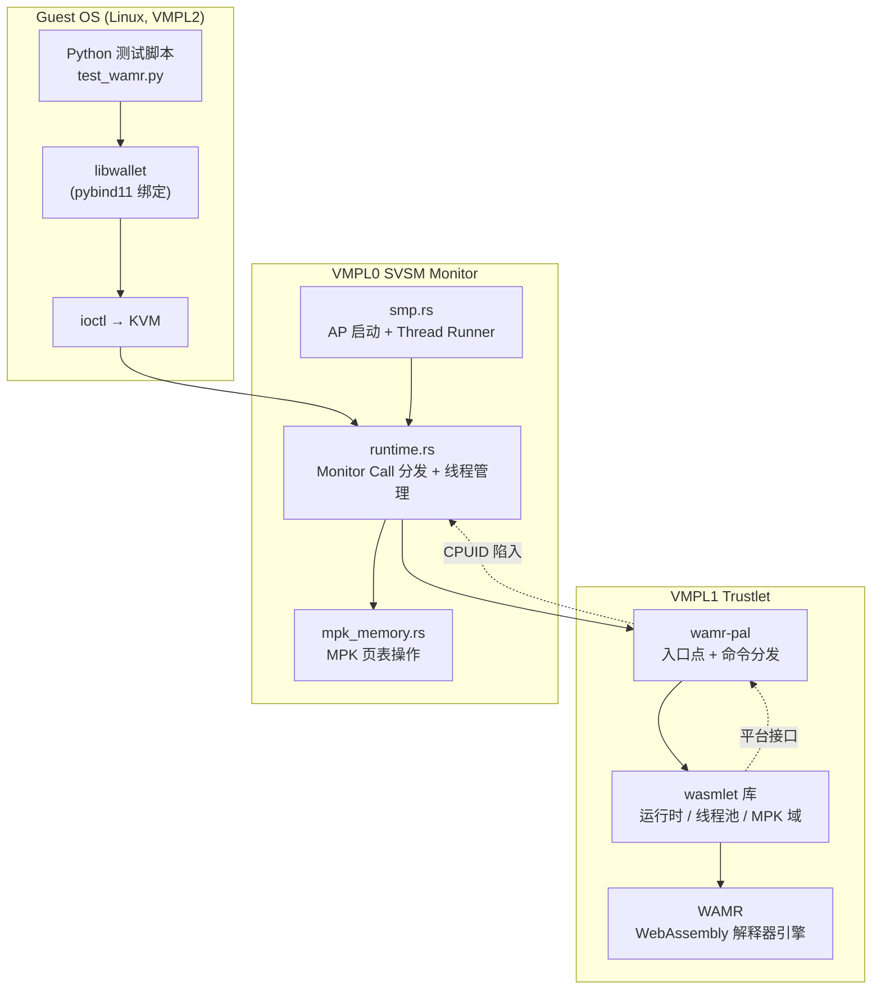
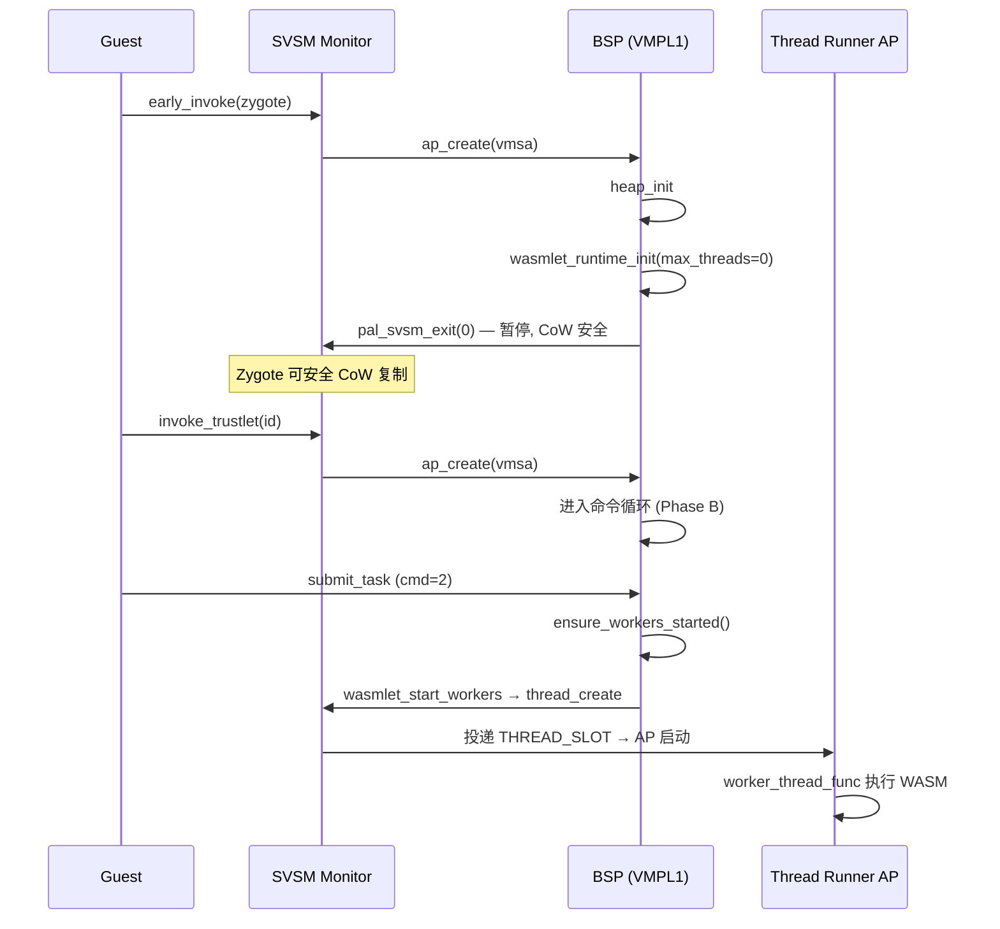
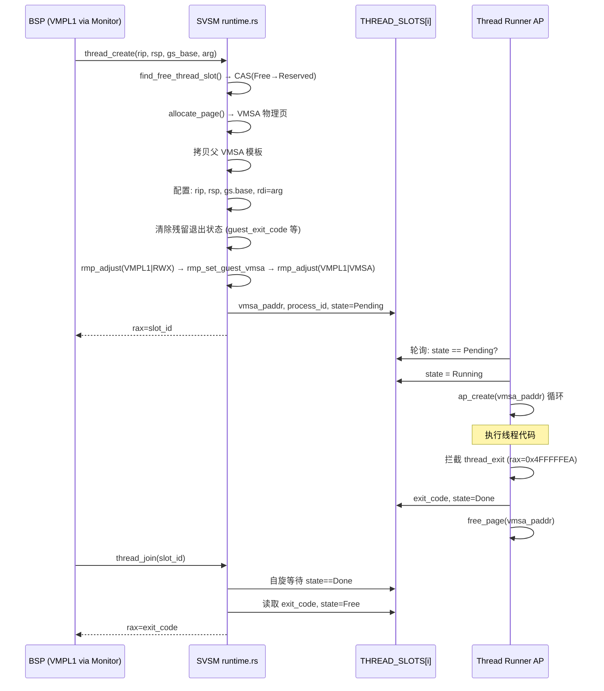
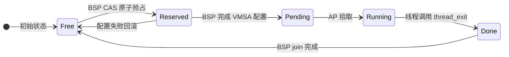
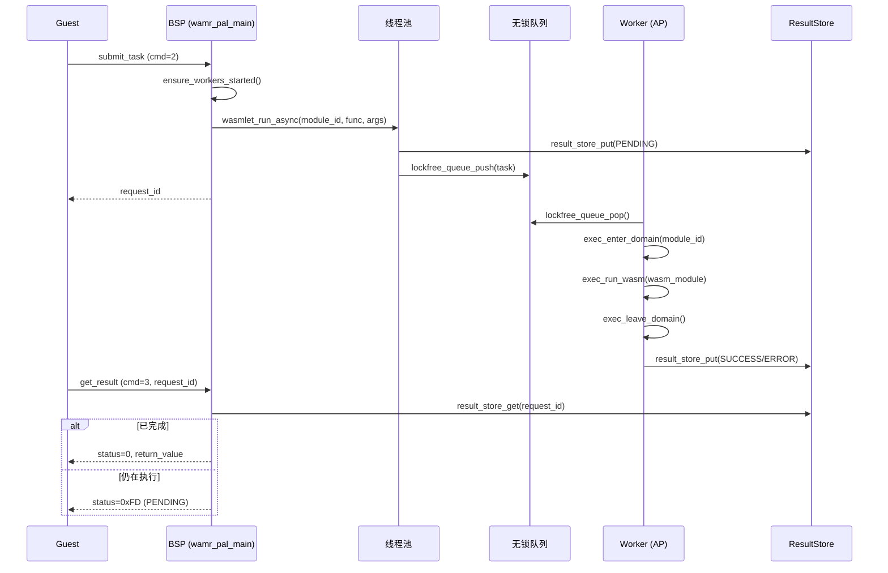
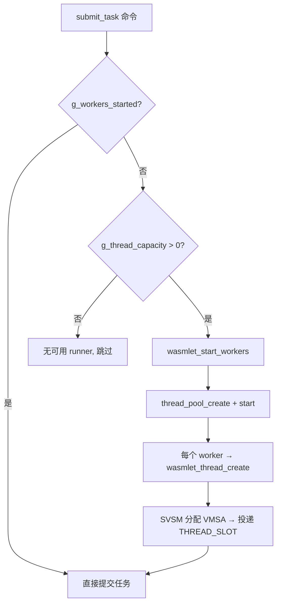
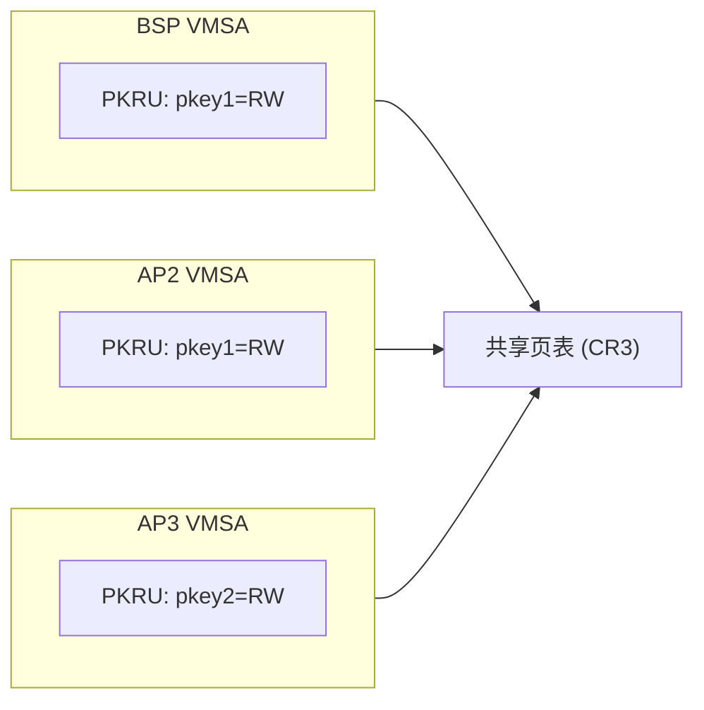
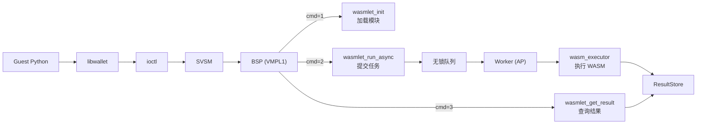

# 多线程 WASM 异步执行 — 设计文档

本文档描述 VMPL1 Trustlet 多线程异步执行 WASM 函数的完整设计方案，涵盖系统架构、SVSM 线程管理、异步执行流水线、MPK 隔离模型、并发安全分析，以及开发过程中遇到的疑难问题与解决方案。

## 目录

- [1. 系统架构](#1-系统架构)
- [2. 模块组成](#2-模块组成)
- [3. SVSM 线程管理](#3-svsm-线程管理)
- [4. 异步执行流水线](#4-异步执行流水线)
- [5. MPK 隔离模型](#5-mpk-隔离模型)
- [6. 并发安全分析](#6-并发安全分析)
- [7. 数据流](#7-数据流)
- [8. 配置参数](#8-配置参数)
- [9. 疑难问题与解决方案](#9-疑难问题与解决方案)

---

## 1. 系统架构

### 1.1 系统分层



### 1.2 多 vCPU 模型

| 角色 | APIC ID | 职责 |
|------|---------|------|
| **BSP**（Bootstrap Processor） | 0 | 运行 Trustlet 主逻辑：初始化、命令分发、模块加载、结果查询 |
| **Request Loop AP** | 1 | 运行 `ap_request_loop`，处理 Guest 请求 |
| **Thread Runner AP** | 2 ~ N | 每个 AP 绑定一个 `THREAD_SLOTS` 槽位，执行 worker 线程 |

关键设计决策：
- **1:1 绑定**：每个 Thread Runner AP 监听恰好一个线程槽，无需调度器。AP 将一个线程执行完毕后才接受下一个。
- **`THREAD_RUNNER_BASE_APIC = 2`**：APIC 0 为 BSP，APIC 1 运行 `ap_request_loop` 处理 Guest 请求，APIC 2+ 为 Thread Runner。

### 1.3 Zygote / Trustlet 两阶段模型



- **Phase A（early_invoke）**：BSP 执行 `heap_init` → `wasmlet_runtime_init` → `pal_svsm_exit(0)`。**不创建 worker**（`max_threads=0`），确保页表状态可安全 CoW 复制。
- **Phase B（invoke_trustlet 循环）**：BSP 进入命令分发循环。Worker 在首次 `submit_task` 时惰性启动。

---

## 2. 模块组成

### 2.1 wamr-pal（VMPL1 入口与平台适配）

| 文件 | 职责 |
|------|------|
| `wamr_pal_main.c` | VMPL1 入口点，Phase A/B 执行模型，命令分发 |
| `pal_monitor_call.c/h` | CPUID 陷入封装，所有 SVSM monitor call 的 C 接口 |
| `platform_vmpl1.c` | wasmlet 平台抽象层 VMPL1 实现（TLS、互斥锁、线程、MPK、时间） |
| `config_vmpl1.c` | 最小配置桩（VMPL1 上由 main 提供配置） |
| `platform/vmpl1/vmpl1_thread.c` | WAMR 线程/互斥/条件变量/读写锁 API 的 VMPL1 实现 |
| `platform/vmpl1/vmpl1_platform.c` | WAMR 平台初始化、printf、内存映射 |
| `platform/vmpl1/vmpl1_mmap.c` | 裸机 mmap 模拟（bump 分配器 + SVSM virt_alloc） |
| `platform/vmpl1/vmpl1_time.c` | 基于 RDTSC 的时间接口 |
| `pal_string.c/h` | freestanding 字符串函数 |
| `pal_malloc.c/h` | 裸机堆管理（dlmalloc） |
| `pal_spinlock.h` | 基于 xchg 的自旋锁 |

### 2.2 SVSM Monitor（VMPL0 线程管理与 MPK）

| 文件 | 职责 |
|------|------|
| `kernel/src/process_runtime/runtime.rs` | Monitor Call 分发、线程 VMSA 管理、Thread Runner 空转循环 |
| `kernel/src/process_manager/mpk_memory.rs` | MPK 六接口：pkey 分配/释放、内存分配/释放、域进入/退出 |
| `kernel/src/cpu/smp.rs` | AP 启动序列、Thread Runner 角色分配 |
| `kernel/src/process_manager/process_paging.rs` | 页表操作（add_pages, remove_pages, map_4k_page） |

### 2.3 wasmlet 库（运行时核心）

| 文件 | 职责 |
|------|------|
| `src/core/wasmlet.c` | 对外 API：init、run、run_async、get_result、start_workers |
| `src/core/runtime_internal.c` | WAMR 运行时生命周期 |
| `src/core/module_internal.c` | WASM 模块加载/卸载/引用计数 |
| `src/core/result_store.c` | 异步结果存储 |
| `src/threadpool/thread_pool.c` | 线程池：创建、启动、提交、停止、销毁 |
| `src/threadpool/lockfree_queue.c` | Vyukov MPMC 无锁环形队列 |
| `src/isolation/mpk_allocator.c` | MPK 域管理 + dlmalloc mspace |
| `include/wasmlet_platform.h` | 平台抽象层接口定义 |

---

## 3. SVSM 线程管理

### 3.1 Monitor Call 接口

| 调用 | 调用号 | 参数 | 返回 |
|------|--------|------|------|
| `thread_create` | `0x4FFFFFEC` | rbx=rip, rcx=rsp, rdx=gs_base, r8=arg | rax=slot_id (成功) 或 MAX (失败) |
| `thread_join` | `0x4FFFFFEB` | rbx=slot_id | rax=exit_code |
| `thread_exit` | `0x4FFFFFEA` | rbx=exit_code | 不返回 |
| `query_capacity` | `0x4FFFFFE9` | 无 | rax=可用 runner 数量 |

### 3.2 VMSA 生命周期



### 3.3 线程槽状态机



| 状态 | 值 | 含义 |
|------|----|------|
| `Free` | 0 | 空闲，可分配 |
| `Reserved` | 1 | BSP 已原子抢占，正在配置 VMSA |
| `Pending` | 2 | VMSA 配置完毕，等待 AP 拾取 |
| `Running` | 3 | AP 正在执行线程 |
| `Done` | 4 | 线程已退出，等待 BSP join |

### 3.4 数据结构

```rust
pub const MAX_THREAD_RUNNERS: usize = 7;

pub struct ThreadSlotShared {
    pub state: AtomicU8,        // 槽位状态（ThreadSlotState 枚举值）
    pub vmsa_paddr: AtomicU64s

pub static THREAD_SLOTS: [ThreadSlotShared; MAX_THREAD_RUNNERS] = [...];
pub static NUM_ACTIVE_RUNNERS: AtomicU64 = AtomicU64::new(0);
```

### 3.5 TLS 实现

每个 worker 线程拥有独立的线程控制块（TCB），通过 `GS.base` 访问：

```c
struct thread_tcb {
    struct thread_tcb *self;                     // 自指针（用于 GS:0 寻址）
    uint64_t           thread_id;                // 线程标识
    void              *tls_slots[WASMLET_TLS_MAX_KEYS]; // TLS 数据槽
};
```

**线程创建时的 TLS 设置流程**：

1. `wasmlet_thread_create` 在栈区域底部分配 TCB
2. 将 TCB 地址作为 `gs_base` 传给 `pal_svsm_thread_create`
3. SVSM 在新 VMSA 中设置 `new_vmsa.gs.base = gs_base`
4. Worker 启动后即可通过 `mov %%gs:0, %0` 访问 TCB

**线程标识的选择**：使用 TCB 指针（而非 `thread_id`）作为线程标识，因为：
- 主线程的 `thread_id` 为 0，与 `korp_mutex.owner` 的哨兵值 (0) 冲突
- Worker 的 `thread_id` 在 `thread_create` 返回后才设置，存在竞态
- TCB 地址对每线程唯一且始终非零

### 3.6 Thread Runner 空转循环

```rust
pub extern "C" fn thread_runner_idle() {
    // 初始化 monitor 上下文
    crate::process_manager::monitor_init();
    let slot_idx = apic_id_to_slot(this_cpu().get_apic_id());

    // 越界保护
    if slot_idx >= MAX_THREAD_RUNNERS { /* parking loop */ }

    loop {
        let state = THREAD_SLOTS[slot_idx].state.load(Acquire);
        if state == Pending {
            THREAD_SLOTS[slot_idx].state.store(Running, Release);
            run_thread_on_this_cpu(slot_idx);
            // 释放 VMSA 页 + 标记 Done
            free_page(vmsa_paddr);
            THREAD_SLOTS[slot_idx].state.store(Done, Release);
        }
        core::hint::spin_loop();
    }
}
```

---

## 4. 异步执行流水线

### 4.1 命令分发

BSP 在 Phase B 进入命令循环，从固定虚拟地址 `0x28000000000`（输入通道）读取命令：

| 命令 | 值 | 描述 |
|------|----|------|
| `sync_invoke` | 0 | 同步调用：加载（可选）+ 执行 |
| `load_module` | 1 | 加载 WASM 模块，返回 module_id |
| `submit_task` | 2 | 提交异步任务到线程池 |
| `get_result` | 3 | 按 request_id 查询异步执行结果 |
| `destroy` | 0xFF | 卸载模块、等待 worker、销毁运行时 |

### 4.2 输入通道协议

```
偏移     大小    字段
0        4       wasm_size      (WASM 字节码大小，同步模式用)
4        4       func_name_len  (函数名长度)
8        2       argc           (参数个数)
10       2       command        (命令类型)
12       ...     payload        (命令特定负载)
```

### 4.3 线程池与异步流程



### 4.4 惰性 Worker 启动



惰性启动的必要性：
- Phase A 中不能创建 worker，否则 CoW 复制时 worker vCPU 仍在运行
- 同步测试（cmd=0）不需要 worker，提前启动会在 shutdown 时因 `thread_join` 死锁

---

## 5. MPK 隔离模型

### 5.1 SVSM MPK 六接口

| 接口 | 调用号 | VMPL1 封装 | 描述 |
|------|--------|------------|------|
| pkey_alloc | `0x4FFFFFF1` | `wasmlet_pkey_alloc()` | 从位图分配一个 pkey (1-15) |
| mpk_alloc | `0x4FFFFFF3` | `wasmlet_mem_map(size, pkey)` | 分配物理页并在 PTE 中标记 pkey |
| enter_domain | `0x4FFFFFF0` | `wasmlet_pkru_set(pkey)` | 在 VMSA.PKRU 中清除 pkey 的 AD 位 |
| exit_domain | `0x4FFFFFEF` | `wasmlet_pkru_reset(pkey)` | 在 VMSA.PKRU 中设置 pkey 的 AD 位 |
| mpk_free | `0x4FFFFFF2` | `wasmlet_mem_unmap(addr, size)` | 释放物理页，清除 PTE 中的 pkey |
| free_pkey | `0x4FFFFFEE` | `wasmlet_pkey_free(pkey, addr, size)` | 释放 pkey（可选同时释放内存） |

### 5.2 每 vCPU PKRU 独立性

PKRU 存储在每个 vCPU 的 VMSA 中。SVSM 修改 `vmsa.pkru` 进行域进入/退出时，仅影响该 vCPU。多个 worker 可安全地并发进入同一 MPK 域 —— 各自修改自己 VMSA 的 PKRU 字段。



### 5.3 安全策略

SVSM `enter_domain` 实现中包含安全策略检查：

- **单域互斥**：除 pkey 0 外，同一时刻只允许一个 pkey 权限处于打开状态
- 检查方式：遍历 PKRU 中 pkey 1-15 的位，若已有其他 pkey 权限打开则拒绝

### 5.4 模块堆 vs 执行堆

| 堆类型 | pkey | 生命周期 | 用途 |
|--------|------|----------|------|
| **模块堆** (module_msp) | 1-15 | 模块生命周期 | WASM 字节码、WAMR 内部结构 |
| **执行堆** (exec_msp) | 0 | 单次执行 | wasm_runtime_instantiate 的实例数据 |
| **默认堆** (default_msp) | 0 | 全局 | 运行时基础设施 |

### 5.5 已知限制：exec heap 使用 pkey=0

执行堆使用 `pkey=0`（始终可访问），硬件 MPK 不保护 exec heap 内存。原因：

- SVSM 的 `add_pages` 创建新页表项，没有 API 修改已映射页的 pkey
- 对已有页面 free+realloc 到同一 VA 会导致 SVSM 页分配器 panic

缓解措施：
- 每个 worker 有独立的 TLS exec heap，worker 之间不交叉访问
- 所有 worker 执行相同 Trustlet 的代码，信任域一致

---

## 6. 并发安全分析

### 6.1 页表锁

所有页表修改操作均持有 `PAGE_TABLE_LOCK`（`SpinLock`）：

| 操作 | 锁保护范围 |
|------|-----------|
| `pal_svsm_virt_alloc` | `add_pages` |
| `pal_svsm_virt_free` | `remove_pages` |
| `pal_svsm_mpk_alloc` | `mpk_alloc_memory`（分配物理页 + 映射 + 标记 pkey） |
| `pal_svsm_mpk_free` | `mpk_free_memory`（解除映射 + 释放物理页） |
| `pal_svsm_mpk_free_pkey` | `mpk_free_pkey`（释放 pkey + 可选释放内存） |

必要性：BSP（模块加载）和 AP（worker 初始化 + exec heap 分配）会并发修改共享 CR3 页表。

### 6.2 共享分配器安全

| 分配器 | 线程安全机制 | 使用场景 |
|--------|-------------|---------|
| **dlmalloc** (module_msp) | `USE_LOCKS=1`（内部互斥锁） | 多 worker 并发从同一模块堆分配 |
| **Bump 分配器** (platform_vmpl1.c) | `__atomic_fetch_add` | `wasmlet_mem_map` 的虚拟地址分配 |
| **线程栈分配器** (platform_vmpl1.c) | `__atomic_fetch_add` | `wasmlet_thread_create` 的栈地址分配 |

### 6.3 线程槽原子操作

`find_free_thread_slot` 使用 `compare_exchange(Free → Reserved)` 原子抢占槽位，防止并发 `thread_create` 重复分配同一槽位。

### 6.4 递归互斥锁

```c
typedef struct {
    pal_spinlock_t lock;
    uint64_t owner;    // 持有者线程标识（TCB 地址）
    uint32_t count;    // 递归计数
} korp_mutex;
```

WAMR 内部要求互斥锁支持递归（同一线程可重入），`os_mutex_lock` 在检测到 `owner == self` 时仅递增计数器。

---

## 7. 数据流

### 7.1 整体数据流



### 7.2 详细异步执行流程

1. Guest 发送 `load_module` (cmd=1)，携带 WASM 二进制 → BSP 加载模块 → 返回 `module_id`
2. Guest 发送 `submit_task` (cmd=2)，携带 module_id + 函数名 + 参数 → BSP 入队无锁队列，确保 worker 已启动 → 返回 `request_id`
3. AP worker 从队列弹出任务 → 进入 MPK 域 → 实例化 WASM 模块 → 调用函数 → 将结果存入 ResultStore
4. Guest 发送 `get_result` (cmd=3)，携带 request_id → BSP 查询 ResultStore → 返回状态 + 返回值（或 PENDING=0xFD）
5. Guest 发送 `destroy` (cmd=0xFF) → BSP 卸载模块、等待所有 worker、销毁运行时

---

## 8. 配置参数

| 参数 | 类型 | 当前值 | 说明 |
|------|------|--------|------|
| `max_threads` | uint16_t | 0 (Phase A) | 最大 worker 线程数，Phase B 由 `query_capacity` 确定 |
| `thread_stack_size` | uint32_t | 32KB | 每个 WAMR 实例的栈大小 |
| `max_heap_size` | uint32_t | 32KB | WAMR 堆大小限制 |
| `lf_queue_size` | uint32_t | 64 | 无锁任务队列容量（必须为 2 的幂） |
| `pkey_pool_size` | uint16_t | 15 | 最大 pkey 数量 |
| `mpk_module_heap_size` | uint64_t | 4MB | 每模块持久堆大小 |
| `mpk_exec_heap_size` | uint64_t | 8MB | 每线程临时执行堆大小 |
| `log_level` | uint32_t | 1 (INFO) | 日志级别 |

---

## 9. 疑难问题与解决方案

### 9.1 VMSA RMP 类型错误导致 ap_create 崩溃

**现象**：`ap_create` 启动新线程 VMSA 时 KVM 崩溃，寄存器为默认值（EIP=0xfff0），KVM 未使用写入的 VMSA。

**根因**：VMSA 页在 RMP 中被标记为普通数据页（`RMPFlags::VMPL1 | RMPFlags::RWX`），而 `ap_create` 要求 VMSA 页必须为 VMSA 类型。

**解决**：在 `pal_svsm_thread_create` 中按三步设置 RMP：
1. `rmp_adjust(VMPL1 | RWX)` — 先设为常规可写页
2. `rmp_set_guest_vmsa()` — 设置 guest VMSA 标志
3. `rmp_adjust(VMPL1 | VMSA)` — 改为 VMSA 类型

### 9.2 guest_exit_code 残留导致 ap_create 行为异常

**现象**：新线程 VMSA 从父 VMSA 拷贝后，`ap_create` 在某些迭代中返回但线程代码未执行，表现为 rip 未变化。

**根因**：父 VMSA 在被拷贝时正处于 CPUID 陷入中途，`guest_exit_code`、`guest_exitinfo1/2`、`guest_nrip` 等字段残留脏数据，可能误导 Hypervisor。

**解决**：创建新 VMSA 后，显式清除这些字段：
```rust
new_vmsa.guest_exit_code = GuestVMExit::INVALID;
new_vmsa.guest_exitinfo1 = 0;
new_vmsa.guest_exitinfo2 = 0;
new_vmsa.guest_nrip = 0;
new_vmsa.guest_exitintinfo = 0;
```

### 9.3 AP 角色分配错误导致 Guest 启动挂起

**现象**：`THREAD_RUNNER_BASE_APIC = 1` 时，所有 AP 都运行 `thread_runner_idle`，Guest vCPU 1–3 无法启动。

**根因**：APIC 1 需要运行 `ap_request_loop` 处理 Guest 请求，但被错误分配为 Thread Runner。

**解决**：将 `THREAD_RUNNER_BASE_APIC = 2`。在 CORES=4 配置下：
- APIC 0：BSP
- APIC 1：request_loop（处理 Guest 请求）
- APIC 2、3：Thread Runner

### 9.4 线程槽分配竞态

**现象**：并发 `thread_create` 可能分配到同一个槽位，导致 VMSA 覆盖。

**根因**：早期实现中 `find_free_thread_slot` 使用非原子的读-写序列检查槽位状态。

**解决**：引入 `Reserved` 中间状态，使用 CAS 原子操作：
```rust
THREAD_SLOTS[i].state.compare_exchange(
    Free as u8, Reserved as u8,
    AtomicOrdering::AcqRel, AtomicOrdering::Acquire
)
```
BSP 原子抢占槽位后配置 VMSA，完成后才转为 `Pending`，确保 AP 看到完整数据。

### 9.5 页表并发修改导致损坏

**现象**：BSP 和 Worker AP 并发通过 monitor call 分配内存时，页表偶尔损坏导致 #PF。

**根因**：`add_pages`、`remove_pages`、`mpk_alloc_memory` 等页表操作无锁保护，BSP（模块加载时）和 AP（worker init 分配 exec heap 时）可能并发修改同一份页表（共享 CR3）。

**解决**：在 `runtime.rs` 中添加全局 `PAGE_TABLE_LOCK`（SpinLock），所有涉及页表修改的 monitor call 处理函数均需先获取锁。

### 9.6 wasmlet_mem_map 中 memset 触发 MPK violation

**现象**：`#PF: MPK protection key violation at CR2=0x60004000000`，PKRU=0x55555554。

**根因**：`wasmlet_mem_map` 对 pkey>0 的内存执行 `memset(addr, 0, size)` 清零，但此时 PKRU 仍禁止访问该 pkey。

**解决**：对 pkey>0 的内存不做 memset，SVSM 分配的物理页已是零页。

### 9.7 CoW 安全与 Worker 创建时机

**现象**：若 Phase A 创建了 worker vCPU，Zygote CoW 复制时 worker 可能仍在运行，无法安全 CoW。

**根因**：`wasmlet_runtime_init` 在 Phase A 就启动 worker 线程。CoW 后 Trustlet 的 `thread_pool` 保存的是 Zygote 的 worker slot ID，这些 slot 属于 Zygote 而非 Trustlet。

**解决**：
1. Phase A 使用 `config.max_threads = 0`，不创建 worker
2. Phase B 首次 `submit_task` 时调用 `wasmlet_start_workers(thread_capacity)` 惰性启动

### 9.8 Shutdown 死锁

**现象**：`pal_svsm_thread_join()` 为无超时自旋等待，若 worker 未正常退出，BSP 永远自旋。

**根因**：同步测试不需要 worker，但 worker 在 Phase B 开始时就被启动，shutdown 时 `thread_join` 等待从未拾取任务的 worker。

**解决**：
- 兼容旧版的轻量关机（cmd=0, wasm_size=0）仅卸载模块 + 写输出，直接 `pal_svsm_exit(0)`，不调用 `wasmlet_runtime_destroy`
- 正式关机（cmd=0xFF）先停止线程池再销毁运行时
- 惰性启动确保同步测试不触发 worker 创建

### 9.9 dlmalloc 堆非线程安全

**现象**：多 worker 并发 `malloc`/`free` 导致堆元数据损坏。

**根因**：`create_mspace_with_base(..., 0)` 中 `locked=0` 表示不加锁。

**解决**：将 `locked` 参数改为 `1`，CMake 中启用 `USE_LOCKS=1`。

### 9.10 wasmlet_mem_set_pkey 导致 SVSM panic

**现象**：`mpk_domain_exec_begin` 调用 `wasmlet_mem_set_pkey` 尝试对 exec heap 重新标记 pkey，SVSM 在 free+realloc 同一 VA 时 panic。

**根因**：SVSM 不支持对已映射页面重新标记 pkey。

**解决**：在 VMPL1 平台实现中将 `wasmlet_mem_set_pkey` 实现为 no-op。exec heap 保持 pkey=0，依赖 TLS 隔离而非硬件 MPK。

### 9.11 线程 VMSA 页泄漏

**现象**：每次 thread_create/join 循环泄漏一个 4K 页。

**根因**：`thread_runner_idle` 中线程完成后只设置 `state=Done`，未释放 VMSA 物理页。

**解决**：在 `run_thread_on_this_cpu` 返回后增加 `free_page(vmsa_paddr)` 释放物理页。

### 9.12 x86-64 ABI 栈对齐导致 triple-fault

**现象**：Worker 线程入口函数 `thread_entry` 在 GCC -O2 下崩溃（triple-fault），无任何日志。

**根因**：x86-64 ABI 要求函数入口处 `RSP % 16 == 8`（如同 CALL 压入返回地址后）。SVSM 直接设置 `RSP = stack_top`，但若 `stack_top` 是 16 字节对齐的，则不满足 ABI 要求。GCC -O2 可能生成 `movaps` 指令操作栈上数据，对未对齐地址触发 #GP。

**解决**：`stack_top = base + total - 8`，减去 8 字节使 RSP 满足 ABI 要求。

### 9.13 SVSM 构建未启用 print feature

**现象**：VM 串口输出 `Unknown request code: 1342177260`（0x4FFFFFEC），线程 monitor call 未命中。

**根因**：直接使用 `cargo build` 而非 `make build_svsm` 构建 SVSM，未启用 `print` feature。LLVM 将无日志的线程处理函数优化合并到默认分支。

**解决**：始终使用 `make build_svsm` 构建，确保包含 `enable-gdb` + `print` feature。
