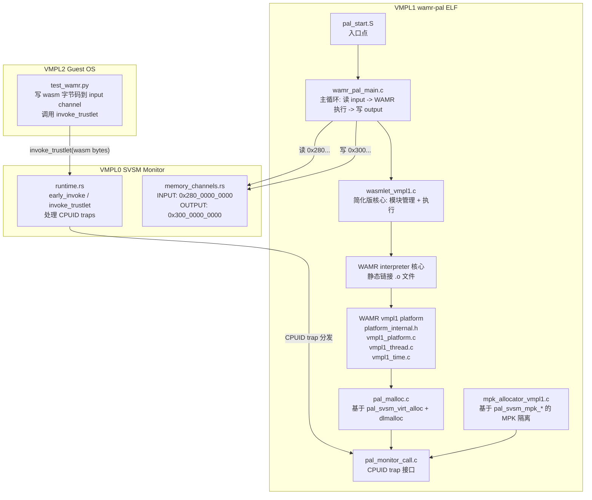
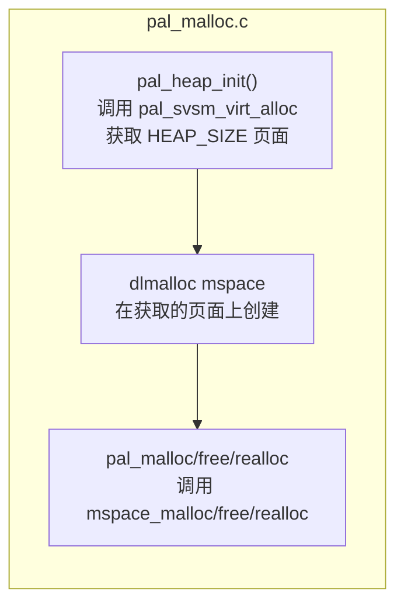
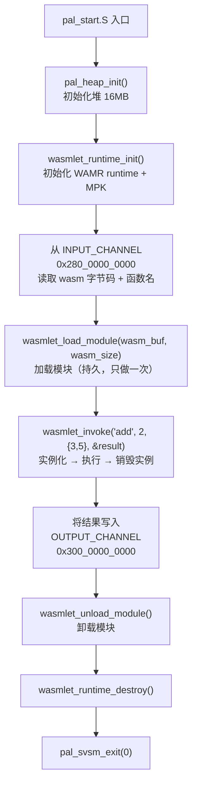

# Phase 2: 集成 WAMR Runtime 到裸机 VMPL1 ELF

## 整体架构



## 核心设计决策

### 1. 简化的并发模型

根据用户要求：

- **一个模块同一时刻只有一个线程实例化**（去掉 wasmlet 中并发多线程实例化同一模块的设计）
- **一个 vCPU 绑定一个线程**，运行一个 serverless 函数
- **不实现 WASM 内部多线程**（不需要 `os_thread_create` 等 WAMR platform 线程 API 的实际实现）
- **线程池的任务分发**：线程自己去抢 task（由 host 调度 vCPU），不做线程调度
- **自旋锁**替代 `pthread_mutex`（裸机环境无 pthread）
- **不实现信号量**（线程池暂未使用）
- **多线程部分直接通过 PAL 接口由 SVSM 实现**（如创建线程），不经过 WAMR platform 中转

### 2. 构建方式

不使用 CMake，继续使用 Phase 1 的 Makefile 方式。将 WAMR 源码编译为 `.o` 文件后静态链接到裸机 ELF 中。

### 3. 内存分配器

裸机环境无 `mmap`/`sbrk`，需要实现：

- `pal_malloc.c`：基于 `pal_svsm_virt_alloc` 获取页面 + dlmalloc mspace 管理
- dlmalloc 编译时设置 `MSPACES=1, HAVE_MMAP=0, HAVE_MREMAP=0`，使用自定义 `sbrk` 桩

---

## 文件变更清单

### A. 新增文件（wamr-pal 侧）

| 文件路径 | 用途 |

|----------|------|

| `wamr-pal/platform/vmpl1/platform_internal.h` | WAMR platform 头文件，定义裸机类型（korp_mutex 为自旋锁等） |

| `wamr-pal/platform/vmpl1/vmpl1_platform.c` | `bh_platform_init/destroy`, `os_malloc/free/realloc`, `os_printf/vprintf` |

| `wamr-pal/platform/vmpl1/vmpl1_thread.c` | `os_mutex_*`（自旋锁实现）, `os_self_thread`, `os_thread_get_stack_boundary` 等 |

| `wamr-pal/platform/vmpl1/vmpl1_time.c` | `os_time_get_boot_us`（返回 0，裸机无时钟）, `os_time_thread_cputime_us` |

| `wamr-pal/platform/vmpl1/vmpl1_mmap.c` | `os_mmap/os_munmap/os_mprotect/os_mremap`（基于 pal_svsm_virt_alloc） |

| `wamr-pal/pal_malloc.c` | 全局堆管理：`pal_svsm_virt_alloc` 获取大块内存 + dlmalloc mspace |

| `wamr-pal/pal_malloc.h` | 堆管理头文件 |

| `wamr-pal/pal_string.c` | 裸机 libc 桩：`memset/memcpy/memmove/memcmp/strlen/strcmp/strncmp/strncpy/snprintf` 等 |

| `wamr-pal/pal_string.h` | libc 桩头文件 |

| `wamr-pal/pal_spinlock.h` | 自旋锁定义（`pal_spinlock_t`, `pal_spin_lock/unlock/init`） |

| `wamr-pal/wasmlet_vmpl1.c` | 简化版 wasmlet 核心：runtime_init/destroy, load_module/unload_module, invoke |

| `wamr-pal/wasmlet_vmpl1.h` | 简化版 wasmlet 头文件 |

| `wamr-pal/mpk_allocator_vmpl1.c` | 基于 `pal_svsm_mpk_*` 的 MPK 分配器（替换 Linux mmap/pkey_mprotect） |

| `wamr-pal/mpk_allocator_vmpl1.h` | MPK 分配器头文件 |

### B. 修改文件（wamr-pal 侧）

| 文件路径 | 修改内容 |

|----------|----------|

| [`wamr-pal/Makefile`](wamr-pal/Makefile) | 大幅扩展：添加 WAMR 源码编译规则、dlmalloc 编译、新增 .o 文件列表 |

| [`wamr-pal/wamr_pal_main.c`](wamr-pal/wamr_pal_main.c) | 从 Phase 1 测试代码改为真正的主循环：初始化堆 -> 初始化 WAMR -> 从 input channel 读 wasm -> 执行 -> 写 output channel -> exit |

| [`wamr-pal/pal_monitor_call.h`](wamr-pal/pal_monitor_call.h) | 添加 inflate_channel 等新的 CPUID trap 声明 |

| [`wamr-pal/pal_monitor_call.c`](wamr-pal/pal_monitor_call.c) | 添加 inflate_channel 等新接口实现 |

### C. 从 wasmlet 复用/适配的文件

以下 wasmlet 文件的**逻辑**会被适配到裸机环境（不直接复制，而是重写裸机版本）：

| wasmlet 源文件 | 适配到 | 适配说明 |

|----------------|--------|----------|

| [`wasmlet/src/core/wasmlet.c`](wasmlet/src/core/wasmlet.c) | `wamr-pal/wasmlet_vmpl1.c` | 去掉线程池/异步/result_store，保留 runtime_init + load_module + invoke（实例化+执行+销毁实例）+ unload_module 核心流程，模块加载与实例化分离 |

| [`wasmlet/src/core/runtime_internal.c`](wasmlet/src/core/runtime_internal.c) | 合并到 `wasmlet_vmpl1.c` | 简化：直接调用 wasm_runtime_full_init |

| [`wasmlet/src/core/module_internal.c`](wasmlet/src/core/module_internal.c) | 合并到 `wasmlet_vmpl1.c` | 去掉无锁 slot 管理和引用计数（单线程单模块），保留 wasm_runtime_load（持久模块）/ instantiate+call+deinstantiate（临时实例） |

| [`wasmlet/src/isolation/mpk_allocator.c`](wasmlet/src/isolation/mpk_allocator.c) | `wamr-pal/mpk_allocator_vmpl1.c` | 将 mmap/pkey_mprotect 替换为 pal_svsm_mpk_alloc/enter/exit，dlmalloc mspace 逻辑保留 |

| [`wasmlet/src/isolation/wamr_adaptor.c`](wasmlet/src/isolation/wamr_adaptor.c) | 合并到 `mpk_allocator_vmpl1.c` | RegisterMpkAllocatorForWAMR 逻辑不变 |

| [`wasmlet/src/isolation/pkey_pool.c`](wasmlet/src/isolation/pkey_pool.c) | 合并到 `mpk_allocator_vmpl1.c` | 简化：用固定数组管理 pkey，不需要 lockfree_queue |

| [`wasmlet/third_party/dlmalloc/malloc.c`](wasmlet/third_party/dlmalloc/malloc.c) | 直接编译到 ELF | 编译参数: `-DMSPACES=1 -DHAVE_MMAP=0 -DHAVE_MREMAP=0 -DLACKS_UNISTD_H -DLACKS_SYS_PARAM_H` 等 |

| [`wasmlet/third_party/dlmalloc/malloc.h`](wasmlet/third_party/dlmalloc/malloc.h) | 直接使用 | 不修改 |

### D. 从 wasmlet 中**不需要**的文件/功能

| 文件/功能 | 原因 |

|-----------|------|

| `src/threadpool/thread_pool.c` | Phase 2 原型为单 vCPU 单线程，不需要线程池。多 vCPU 并发在后续 Phase 实现 |

| `src/threadpool/lockfree_queue.c` | 同上，暂不需要 |

| `src/core/result_store.c` | 同步执行，直接返回结果，不需要异步结果存储 |

| `src/utils/config.c` | 裸机环境无配置文件，硬编码配置 |

| `src/utils/logging.c` | 用 `pal_svsm_debug_print` 替代 |

| `src/cli/main.c` | 裸机无 CLI，主入口为 `wamr_pal_main.c` |

| `include/lockfree_queue.h` / `lockfree_queue.c` | Phase 2 单线程原型不需要无锁队列 |

| `include/atomic_compat.h` | 裸机 GCC 内置 `__atomic_*` 可直接使用，不需要兼容层 |

### E. WAMR 源码需要编译的文件

以下是需要从 WAMR 源码树中编译并链接到裸机 ELF 的文件清单。基于 WAMR 的 cmake 构建系统分析，我们只启用 **classic interpreter** 模式，禁用 AOT/JIT/GC/WASI/Thread-mgr 等所有高级特性。

**WAMR 源码根目录**: `wasmlet/WAMR-wasmlet/`

#### E.1 Platform 层（我们自己实现，替换 linux-sgx）

| 文件 | 说明 |

|------|------|

| `wamr-pal/platform/vmpl1/vmpl1_platform.c` | 替换 `sgx_platform.c` |

| `wamr-pal/platform/vmpl1/vmpl1_thread.c` | 替换 `sgx_thread.c` |

| `wamr-pal/platform/vmpl1/vmpl1_time.c` | 替换 `sgx_time.c` |

| `wamr-pal/platform/vmpl1/vmpl1_mmap.c` | 替换 `sgx_platform.c` 中的 mmap 部分 |

#### E.2 WAMR 内核源码（从 WAMR 源码树编译 .o）

**Interpreter 核心** (`core/iwasm/interpreter/`):

| 文件 | 说明 |

|------|------|

| `wasm_loader.c` | WASM 模块加载器（非 mini_loader） |

| `wasm_runtime.c` | WASM interpreter 运行时 |

| `wasm_interp_classic.c` | 经典解释器（非 fast interp） |

**Common 层** (`core/iwasm/common/`):

| 文件 | 说明 |

|------|------|

| `wasm_runtime_common.c` | 运行时公共接口（`wasm_runtime_full_init` 等） |

| `wasm_native.c` | Native 函数注册 |

| `wasm_exec_env.c` | 执行环境管理 |

| `wasm_memory.c` | WASM 线性内存管理 |

| `wasm_application.c` | 应用入口（`wasm_application_execute_func`） |

| `wasm_loader_common.c` | 加载器公共代码 |

| `wasm_c_api.c` | C API 实现（可选，如不需要可排除） |

| `wasm_blocking_op.c` | 阻塞操作（桩实现） |

| `wasm_shared_memory.c` | 共享内存（编译但禁用功能） |

| `arch/invokeNative_em64.s` | x86_64 native 函数调用桥接汇编 |

**内存分配** (`core/shared/mem-alloc/`):

| 文件 | 说明 |

|------|------|

| `mem_alloc.c` | WAMR 内部内存分配器入口 |

| `ems/ems_kfc.c` | EMS 内存分配核心 |

| `ems/ems_alloc.c` | EMS 分配算法 |

| `ems/ems_hmu.c` | EMS 头管理单元 |

| `ems/ems_gc.c` | EMS GC（编译但 GC 功能禁用） |

**工具库** (`core/shared/utils/`):

| 文件 | 说明 |

|------|------|

| `bh_assert.c` | 断言 |

| `bh_common.c` | 公共工具 |

| `bh_hashmap.c` | 哈希表 |

| `bh_leb128.c` | LEB128 编解码 |

| `bh_list.c` | 链表 |

| `bh_log.c` | 日志 |

| `bh_queue.c` | 队列 |

| `bh_vector.c` | 动态数组 |

| `bh_bitmap.c` | 位图 |

---

## 详细实现步骤

### Step 1: 创建裸机 libc 桩 (`pal_string.c/h`)

裸机环境没有标准 C 库，但 WAMR 源码大量使用 libc 函数。需要实现以下桩函数：

**字符串/内存操作**:

- `memset`, `memcpy`, `memmove`, `memcmp`
- `strlen`, `strcmp`, `strncmp`, `strncpy`, `strchr`, `strstr`, `strcpy`
- `snprintf`, `vsnprintf`（简化版，支持 `%s`, `%d`, `%x`, `%u`, `%p`, `%lu`, `%lx`, `%c`, `%%`）

**类型转换**:

- `strtol`, `strtoul`（简化版）
- `atoi`

**其他**:

- `abort`（调用 `pal_svsm_exit(1)`）
- `qsort`（简化版，WAMR 内部用到）
- `isalnum`, `isprint`, `isdigit` 等 ctype 函数

#### Step 1 补充：热路径内存函数的 x86-64 硬件优化

**背景**：纯逐字节 C 循环实现的 `memcpy`/`memset` 在大块拷贝时性能差（4KB 数据需要 ~4000-8000 cycles）。考虑了四种替代方案后，采用 **方案1(编译器 builtins) + 方案4(x86-64 REP 字符串指令)** 的混合策略：

| 方案 | 结论 |

|------|------|

| 编译器 builtins | ✅ 已自动生效（-O2 下小拷贝内联为 MOV），但变长拷贝仍需符号 |

| newlib/picolibc | ❌ 只需 ~25 个函数，引入整个 libc 构建复杂度过高 |

| SVSM 侧提供 | ❌ CPUID trap 开销 ~2000-5000 cycles，热路径不可接受 |

| **REP MOVSB/STOSB** | ✅ **采用**。CPU 支持 ERMS，性能提升 20-40 倍，不需要 SSE/AVX |

**具体修改**（已实现）：

| 函数 | 指令 | 说明 |

|------|------|------|

| `memset` | `rep stosb` | 硬件自动选择最优传输宽度 |

| `memcpy` | `rep movsb` | ERMS 加速，大块拷贝接近 SIMD 性能 |

| `memmove` | 正向 `rep movsb` / 反向 `std; rep movsb; cld` | 处理内存重叠 |

| `memcmp` | `repe cmpsb` | 逐字节比较，首次不匹配即停止 |

**优势**：

- 不需要 SSE/AVX 状态（VMPL1 裸机可能未初始化 FPU/SIMD）
- 只用整数寄存器（rdi, rsi, rcx）
- 代码极紧凑（memcpy 仅 3 条指令）
- ELF 体积反而减小 320 字节（32400 → 32080）

**其余函数**（strlen/strcmp/snprintf/qsort/ctype 等）保持纯 C 实现，非热路径，性能足够。

### Step 2: 创建堆管理器 (`pal_malloc.c/h`)



- 初始化时通过 `pal_svsm_virt_alloc` 向 VMPL0 申请一块大内存（如 16MB）
- 在该内存上创建 dlmalloc `mspace`
- 所有 `malloc/free/realloc` 通过 `mspace_*` 函数管理
- dlmalloc 编译参数：`-DMSPACES=1 -DHAVE_MMAP=0 -DHAVE_MREMAP=0 -DLACKS_UNISTD_H -DLACKS_SYS_PARAM_H -DLACKS_SYS_MMAN_H -DLACKS_FCNTL_H -DLACKS_ERRNO_H -Dmalloc_getpagesize=4096`

### Step 3: 创建自旋锁 (`pal_spinlock.h`)

```c
typedef struct { volatile int locked; } pal_spinlock_t;
#define PAL_SPINLOCK_INIT {0}
static inline void pal_spin_lock(pal_spinlock_t *l) {
    while (__atomic_test_and_set(&l->locked, __ATOMIC_ACQUIRE)) {
        __asm__ volatile("pause" ::: "memory");
    }
}
static inline void pal_spin_unlock(pal_spinlock_t *l) {
    __atomic_clear(&l->locked, __ATOMIC_RELEASE);
}
```

### Step 4: 创建 WAMR VMPL1 Platform

#### 4.1 `platform_internal.h`

定义裸机环境的类型映射：

```c
#ifndef PLATFORM_INTERNAL_H
#define PLATFORM_INTERNAL_H

#include <stdint.h>
#include <stddef.h>
#include <stdarg.h>
#include <stdbool.h>
#include "pal_spinlock.h"
#include "pal_string.h"
#include "pal_malloc.h"

// WAMR 需要的类型定义
typedef unsigned int korp_mutex;        // 自旋锁（uint32 flag）
typedef unsigned int korp_cond;         // 条件变量（桩，不实际使用）
typedef unsigned long korp_thread;      // 线程 ID
typedef int os_file_handle;
typedef void* os_dir_stream;
typedef int os_raw_file_handle;

#define BH_PLATFORM_VMPL1

// 禁用不需要的功能
#define BH_HAS_DLFCN 0
#define SGX_DISABLE_WASI
#define SGX_DISABLE_PTHREAD

// 页面大小
#define os_getpagesize() 4096
#define getpagesize() 4096

// 文件句柄无效值
#define OS_INVALID_FILE_HANDLE (-1)

#endif
```

#### 4.2 `vmpl1_platform.c`

实现 `platform_api_vmcore.h` 中的核心函数：

- `bh_platform_init()` / `bh_platform_destroy()` - 初始化/销毁平台
- `os_malloc()` / `os_realloc()` / `os_free()` - 委托给 `pal_malloc`
- `os_printf()` / `os_vprintf()` - 使用 `pal_svsm_debug_print` 输出
- `os_dumps_proc_mem_info()` - 返回 -1（不支持）
- `os_set_print_function()` - 保存回调函数指针
- `os_dcache_flush()` / `os_icache_flush()` - 空实现

#### 4.3 `vmpl1_mmap.c`

实现 WAMR 需要的内存映射接口：

- `os_mmap(hint, size, prot, flags, file)` - 基于 `pal_svsm_virt_alloc` 分配对齐页面
- `os_munmap(addr, size)` - 基于 `pal_svsm_free` 释放页面
- `os_mprotect(addr, size, prot)` - 基于 `pal_svsm_mprotect`（如需要）或空实现
- `os_mremap(old_addr, old_size, new_size)` - 分配新区域 + memcpy + 释放旧区域
- `os_is_handle_valid(handle)` - 返回 false（不支持文件）

注意：`os_mmap` 需要维护一个简单的地址分配器，从一个固定的高地址区域（如 `0x50000000000`）开始递增分配，避免与堆和其他映射冲突。

#### 4.4 `vmpl1_thread.c`

实现线程相关 API（大部分为桩或自旋锁）：

- `os_mutex_init()` / `os_mutex_destroy()` / `os_mutex_lock()` / `os_mutex_unlock()` - 自旋锁
- `os_cond_init()` / `os_cond_destroy()` / `os_cond_wait()` / `os_cond_signal()` / `os_cond_broadcast()` - 桩（返回 0）
- `os_self_thread()` - 返回固定值 1
- `os_thread_get_stack_boundary()` - 返回 NULL（禁用了栈边界检查）

#### 4.5 `vmpl1_time.c`

- `os_time_get_boot_us()` - 返回 0（裸机无时钟）
- `os_time_thread_cputime_us()` - 返回 0

### Step 5: 创建 MPK 分配器 (`mpk_allocator_vmpl1.c/h`)

适配 wasmlet 的 [`mpk_allocator.c`](wasmlet/src/isolation/mpk_allocator.c) 到裸机环境：

| 原 wasmlet 调用 | 裸机替换 |

|-----------------|---------|

| `mmap(MAP_ANONYMOUS)` | `pal_svsm_mpk_alloc(addr, size, pkey)` |

| `pkey_mprotect()` | 不需要（`pal_svsm_mpk_alloc` 已设置 pkey） |

| `pkey_alloc()` | `pal_svsm_mpk_pkey_alloc()` |

| `pkey_free()` | `pal_svsm_mpk_free_pkey()` |

| `munmap()` | `pal_svsm_mpk_free()` |

| `wrpkru()` | `pal_svsm_mpk_enter_domain()` / `pal_svsm_mpk_exit_domain()` |

| `pthread_mutex_lock()` | `pal_spin_lock()` |

保留 dlmalloc `mspace` 管理逻辑（每个 pkey 域有独立的 mspace）。

保留 `RegisterMpkAllocatorForWAMR()` 逻辑（注册自定义分配器到 WAMR）。

pkey 池管理简化为固定数组（最多 15 个 pkey），不需要 lockfree_queue。

### Step 5 补充：保留非 MPK 编译开关以便调试

为了在开发初期能够先跑通基本流程（不依赖 MPK），再逐步启用 MPK 隔离，需要在代码中加入编译开关：

**编译宏**: `ENABLE_MPK_ISOLATION`

```makefile
# Makefile 中控制 MPK 开关
# 默认关闭，先跑通基本流程
# WAMR_DEFS += -DENABLE_MPK_ISOLATION=1
```

**影响范围**：

| 模块 | `ENABLE_MPK_ISOLATION=0`（默认） | `ENABLE_MPK_ISOLATION=1` |

|------|----------------------------------|--------------------------|

| `wasmlet_vmpl1.c` runtime_init | 直接调用 `wasm_runtime_full_init()` 使用默认 `os_malloc` 分配器 | 先调用 `mpk_allocator_init()`，再 `RegisterMpkAllocatorForWAMR()` 注册 MPK 分配器 |

| `wasmlet_vmpl1.c` load_module | 直接 `wasm_runtime_load()` 加载模块 | 先 `pkey_alloc()` 分配 pkey，`mpk_set_current_pkey(pkey)` 后再加载，确保模块元数据内存被正确标记 |

| `wasmlet_vmpl1.c` invoke | 直接 `wasm_runtime_instantiate()` → 执行 → `wasm_runtime_deinstantiate()` | `mpk_set_current_pkey(module_pkey)` 后再实例化，确保实例内存也标记模块的 pkey；执行完后 deinstantiate 释放实例内存 |

|| `wasmlet_vmpl1.c` unload_module | 直接 `wasm_runtime_unload()` | 额外调用 `pkey_free()` 释放 pkey，`pal_svsm_set_pkey(addr, size, 0)` 取消 pkey 标记 |

| `os_malloc` / `os_free` | 走 `pal_malloc` → dlmalloc 全局堆 | 走 `mpk_malloc` → 按当前 pkey 分配到对应域的 mspace |

| Makefile | 不编译 `mpk_allocator_vmpl1.c` | 编译 `mpk_allocator_vmpl1.c` 并链接 |

**代码示例**（`wasmlet_vmpl1.c` 中的条件编译）：

```c
int wasmlet_runtime_init(void)
{
    RuntimeInitArgs init_args;
    memset(&init_args, 0, sizeof(init_args));

#if ENABLE_MPK_ISOLATION
    /* MPK 模式：注册 MPK 分配器替换 WAMR 默认分配器 */
    if (mpk_allocator_init() != 0) {
        os_printf("[WASMLET] MPK allocator init failed\n");
        return -1;
    }
    RegisterMpkAllocatorForWAMR(&init_args);
#else
    /* 非 MPK 模式：使用系统分配器（pal_malloc → dlmalloc） */
    init_args.mem_alloc_type = Alloc_With_System_Allocator;
#endif

    if (!wasm_runtime_full_init(&init_args)) {
        os_printf("[WASMLET] WAMR runtime init failed\n");
        return -1;
    }
    return 0;
}
```

**调试流程**：

1. **Phase 2a**（当前）：`ENABLE_MPK_ISOLATION=0`，先跑通 `add(3,5)=8` 的完整流程
2. **Phase 2b**：启用 `ENABLE_MPK_ISOLATION=1`，验证 MPK pkey 分配/设置/释放正确
3. **Phase 3**：多 vCPU 多线程，每个线程的 pkey 域独立

**优势**：

- 降低调试复杂度：先排除 WAMR 集成问题，再排除 MPK 问题
- 快速定位 bug：如果非 MPK 模式能跑通但 MPK 模式出错，问题一定在 MPK 相关代码中
- 保持代码整洁：通过编译开关而非注释代码来切换，避免遗漏

### Step 6: 创建简化版 wasmlet 核心 (`wasmlet_vmpl1.c/h`)

从 wasmlet 的核心逻辑简化而来，合并 `runtime_internal.c` 和 `module_internal.c`。

#### 6.1 关键设计：模块加载与实例化/执行分离

WAMR 原生 API 将模块管理分为**三个独立的生命周期层次**：

| 层次 | WAMR 对象类型 | 创建 API | 销毁 API | 生命周期 |

|------|---------------|----------|----------|----------|

| **模块加载** | `wasm_module_t` | `wasm_runtime_load()` | `wasm_runtime_unload()` | **持久**：编译后的字节码常驻内存，可多次实例化 |

| **模块实例化** | `wasm_module_inst_t` | `wasm_runtime_instantiate()` | `wasm_runtime_deinstantiate()` | **临时**：每次函数调用前创建，调用后销毁 |

| **执行环境** | `wasm_exec_env_t` | `wasm_runtime_create_exec_env()` | `wasm_runtime_destroy_exec_env()` | **临时**：绑定到实例，随实例一起创建/销毁 |

**为什么必须分离**：

1. **模块（`wasm_module_t`）是"类"**：`wasm_runtime_load()` 解析并验证 wasm 字节码，生成内部数据结构（函数签名表、导入/导出表、类型信息等），这个过程开销较大。模块加载后应该**持久保留**在内存中。
2. **实例（`wasm_module_inst_t`）是"对象"**：`wasm_runtime_instantiate()` 为模块分配**独立的线性内存**（WASM Memory）、全局变量副本、表（Table）等运行时状态。每次 serverless 函数调用都应该创建新实例，确保**状态隔离**。
3. **执行环境（`wasm_exec_env_t`）是"线程上下文"**：包含调用栈、当前执行位置等。绑定到实例。

**Serverless 调用模型**：

```
Guest 调用 1: invoke("add", 3, 5)
  → instantiate(module) → exec_env → call_wasm → result=8
  → destroy_exec_env → deinstantiate  ← 实例内存释放，模块保留

Guest 调用 2: invoke("add", 10, 20)
  → instantiate(module) → exec_env → call_wasm → result=30
  → destroy_exec_env → deinstantiate  ← 同一个模块，新的实例

Guest 发送 "unload" 命令:
  → unload(module) ← 模块内存释放
```

#### 6.2 API 设计

```c
/* ===== wasmlet_vmpl1.h ===== */

/* 第一层：Runtime 生命周期（全局，只调用一次） */
int  wasmlet_runtime_init(void);      // 初始化 WAMR runtime（+ MPK 分配器）
void wasmlet_runtime_destroy(void);   // 销毁 WAMR runtime

/* 第二层：Module 生命周期（持久，加载后常驻） */
int  wasmlet_load_module(const uint8_t *wasm_buf, uint32_t wasm_size);
                                       // 加载 wasm 模块 → wasm_module_t
void wasmlet_unload_module(void);     // 卸载模块，释放模块内存

/* 第三层：Invocation 生命周期（临时，每次调用创建/销毁） */
int  wasmlet_invoke(const char *func_name, int argc,
                    uint32_t *argv, uint32_t *result);
                                       // 实例化 + 执行 + 销毁实例
```

**注意**：`wasmlet_invoke()` 内部封装了 instantiate → create_exec_env → lookup_function → call_wasm → destroy_exec_env → deinstantiate 的完整流程。每次调用后，实例的线性内存和执行环境都会被销毁，但模块本身保留。

#### 6.3 内部实现

```c
/* wasmlet_vmpl1.c 内部全局状态 */
static wasm_module_t g_module = NULL;        // 持久：已加载的模块

int wasmlet_load_module(const uint8_t *wasm_buf, uint32_t wasm_size)
{
    char error_buf[128];

#if ENABLE_MPK_ISOLATION
    /* 为模块分配 pkey，后续该模块的所有内存都标记此 pkey */
    g_module_pkey = pkey_alloc();
    mpk_set_current_pkey(g_module_pkey);
#endif

    g_module = wasm_runtime_load((uint8_t *)wasm_buf, wasm_size,
                                 error_buf, sizeof(error_buf));
    if (!g_module) {
        os_printf("[WASMLET] Load failed: %s\n", error_buf);
        return -1;
    }
    return 0;
}

int wasmlet_invoke(const char *func_name, int argc,
                   uint32_t *argv, uint32_t *result)
{
    char error_buf[128];

    /* 1. 实例化（临时） */
    wasm_module_inst_t inst = wasm_runtime_instantiate(
        g_module, 8192 /* stack */, 8192 /* heap */,
        error_buf, sizeof(error_buf));
    if (!inst) {
        os_printf("[WASMLET] Instantiate failed: %s\n", error_buf);
        return -1;
    }

    /* 2. 创建执行环境（临时） */
    wasm_exec_env_t exec_env = wasm_runtime_create_exec_env(inst, 8192);
    if (!exec_env) {
        wasm_runtime_deinstantiate(inst);
        return -1;
    }

    /* 3. 查找并调用函数 */
    wasm_function_inst_t func = wasm_runtime_lookup_function(inst, func_name);
    if (!func) {
        os_printf("[WASMLET] Function '%s' not found\n", func_name);
        wasm_runtime_destroy_exec_env(exec_env);
        wasm_runtime_deinstantiate(inst);
        return -1;
    }

    if (!wasm_runtime_call_wasm(exec_env, func, argc, argv)) {
        os_printf("[WASMLET] Call failed: %s\n",
                  wasm_runtime_get_exception(inst));
        wasm_runtime_destroy_exec_env(exec_env);
        wasm_runtime_deinstantiate(inst);
        return -1;
    }

    /* 4. 获取返回值 */
    if (result)
        *result = argv[0];  /* WAMR 将返回值写回 argv[0] */

    /* 5. 销毁临时资源（实例内存 + 执行环境） */
    wasm_runtime_destroy_exec_env(exec_env);
    wasm_runtime_deinstantiate(inst);

    return 0;
}

void wasmlet_unload_module(void)
{
    if (g_module) {
        wasm_runtime_unload(g_module);
        g_module = NULL;
    }
#if ENABLE_MPK_ISOLATION
    if (g_module_pkey > 0) {
        pkey_free(g_module_pkey);
        g_module_pkey = 0;
    }
#endif
}
```

#### 6.4 与原 wasmlet 的关键差异

- 去掉 `thread_pool` 异步提交
- 去掉 `result_store` 异步结果获取
- 去掉 slot 管理和引用计数（单模块）
- 去掉并发多线程实例化同一模块的逻辑
- **模块加载与实例化分离**：`wasmlet_load_module` 只做 `wasm_runtime_load`，不做 `instantiate`
- **每次调用独立实例化**：`wasmlet_invoke` 内部完成 instantiate → execute → deinstantiate
- 直接同步调用 `wasm_runtime_call_wasm`

### Step 7: 改写主入口 (`wamr_pal_main.c`)



**注意**：在 Phase 2 原型中，只有一次 load → invoke → unload 流程。未来多次调用时，load 只做一次，invoke 可反复调用（每次独立实例化），最后才 unload。

Input channel 数据格式（简化版协议）：

```
[0..3]   uint32_t wasm_size    // wasm 字节码大小
[4..N]   uint8_t  wasm_bytes[] // wasm 字节码内容
```

Output channel 数据格式：

```
[0..3]   uint32_t status       // 0=成功, 非0=错误
[4..7]   uint32_t result       // 函数返回值
```

### Step 8: 扩展 Makefile

需要大幅扩展 [`wamr-pal/Makefile`](wamr-pal/Makefile)：

**关键变更**:

- 添加 WAMR 源码路径变量（`WAMR_DIR = ../wasmlet/WAMR-wasmlet`）
- 添加 WAMR 编译宏定义（见下方汇总）
- 添加 dlmalloc 编译规则（带特殊宏定义）
- 添加所有 WAMR `.c` / `.s` 文件的编译规则
- 添加 include 路径（`-I` 指向 WAMR 各子目录和我们的 platform 目录）
- 更新 `OBJS` 列表包含所有新增 `.o` 文件
- WAMR 的 `.o` 文件输出到 `build/wamr/` 子目录避免与我们的文件混淆

### Step 9: 添加 inflate_channel PAL 接口

在 [`pal_monitor_call.h`](wamr-pal/pal_monitor_call.h) 和 [`pal_monitor_call.c`](wamr-pal/pal_monitor_call.c) 中添加：

```c
// pal_monitor_call.h
int pal_svsm_inflate_channel(int select, uint64_t size);
// select=0: inflate input, select=1: inflate output

// pal_monitor_call.c
int pal_svsm_inflate_channel(int select, uint64_t size) {
    struct monitor_call_data data;
    data.rax = 0x4FFFFFA3;
    data.rbx = 0;
    data.rcx = (uint64_t)select;
    data.rdx = size;
    monitor_call(&data);
    return (int)data.rcx;
}
```

### Step 10: 更新测试脚本

更新 [`module/example/test_wamr.py`](module/example/test_wamr.py)：

- 读取 `add.wasm` 文件内容
- 通过 `invoke_trustlet` 将 wasm 字节码写入 input channel
- 读取 output channel 获取执行结果
- 验证 `add(3, 5) == 8`

---

## WAMR 编译宏定义汇总

以下是编译 WAMR 源码时需要的关键 `-D` 定义：

```makefile
WAMR_DEFS = \
    -DWASM_ENABLE_INTERP=1 \
    -DWASM_ENABLE_FAST_INTERP=0 \
    -DBUILD_TARGET_X86_64 \
    -DBH_PLATFORM_VMPL1 \
    -DBH_MALLOC=wasm_runtime_malloc \
    -DBH_FREE=wasm_runtime_free \
    -DWASM_GLOBAL_HEAP_SIZE=10485760 \
    -DWASM_ENABLE_BULK_MEMORY=1 \
    -DWASM_ENABLE_BULK_MEMORY_OPT=1 \
    -DWASM_DISABLE_HW_BOUND_CHECK=1 \
    -DWASM_DISABLE_STACK_HW_BOUND_CHECK=1 \
    -DWASM_DISABLE_WAKEUP_BLOCKING_OP=1 \
    -DWASM_ENABLE_SHARED_MEMORY=0 \
    -DWASM_ENABLE_MULTI_MODULE=0 \
    -DWASM_ENABLE_MINI_LOADER=0 \
    -DWASM_ENABLE_LIBC_BUILTIN=0 \
    -DWASM_ENABLE_LIBC_WASI=0 \
    -DWASM_ENABLE_AOT=0 \
    -DWASM_ENABLE_JIT=0 \
    -DWASM_ENABLE_GC=0 \
    -DWASM_ENABLE_REF_TYPES=0 \
    -DWASM_ENABLE_TAIL_CALL=0 \
    -DWASM_ENABLE_SIMD=0 \
    -DWASM_ENABLE_QUICK_AOT_ENTRY=0 \
    -DWASM_ENABLE_AOT_INTRINSICS=0 \
    -DWASM_ENABLE_SHRUNK_MEMORY=1 \
    -DWASM_ENABLE_EXCE_HANDLING=0 \
    -DWASM_ENABLE_MEMORY64=0 \
    -DWASM_ENABLE_MULTI_MEMORY=0 \
    -DWASM_ENABLE_STRINGREF=0 \
    -DWASM_ENABLE_CALL_INDIRECT_OVERLONG=0 \
    -DWASM_ENABLE_EXTENDED_CONST_EXPR=0 \
    -DWASM_ENABLE_CUSTOM_NAME_SECTION=0 \
    -DWASM_ENABLE_DUMP_CALL_STACK=0
```

## SVSM 侧（VMPL0）需要的变更

Phase 2 原型**不需要修改 SVSM 代码**。原因：

1. `early_invoke` 的 CPUID trap 循环已经可以处理所有需要的调用（`virt_alloc`, `free`, `debug_print`, `exit`, `mpk_*`, `inflate_channel`）
2. `invoke_trustlet` 的 input/output channel 机制已经可用
3. 所有 MPK 六接口已在 Phase 1 中实现

唯一需要确认的：`inflate_channel`（CPUID `0x4FFFFFA3`）在 `early_invoke` 路径中也能正常工作。从代码看，`handle_process_request` 在 `early_invoke` 和 `invoke_trustlet` 中共用同一个 match 分支，所以应该没问题。

---

## 验证目标

Phase 2 完成后，执行以下验证流程：

1. 编译 `add.wat` -> `add.wasm`（使用 `wat2wasm`）
2. `make` 编译 `wamr_pal.elf`（包含 WAMR interpreter + 所有依赖）
3. `make deploy` 部署到 `module/example/`
4. 在 Guest VM 中运行 `test_wamr.py`
5. 在 SVSM 串口日志中观察到：

   - `[WAMR-PAL] Heap initialized (16 MB)`
   - `[WAMR-PAL] WAMR runtime initialized`
   - `[WAMR-PAL] Module loaded (XX bytes)`
   - `[WAMR-PAL] Instantiating module...`
   - `[WAMR-PAL] Calling add(3, 5)...`
   - `[WAMR-PAL] Result: 8`
   - `[WAMR-PAL] Instance destroyed`
   - `[WAMR-PAL] Module unloaded`

6. Guest 侧 `test_wamr.py` 从 output channel 读取到结果 `8`

---

## 预估工作量

| 步骤 | 预估时间 | 复杂度 |

|------|----------|--------|

| Step 1: libc 桩 | 0.5 天 | 中（snprintf 最复杂） |

| Step 2: 堆管理器 | 0.5 天 | 中 |

| Step 3: 自旋锁 | 0.1 天 | 低 |

| Step 4: WAMR Platform | 1 天 | 高（需要满足 WAMR 所有 platform API） |

| Step 5: MPK 分配器 | 0.5 天 | 中 |

| Step 6: wasmlet 核心 | 0.5 天 | 中 |

| Step 7: 主入口 | 0.3 天 | 低 |

| Step 8: Makefile | 0.5 天 | 中（WAMR 源码路径和编译规则多） |

| Step 9: inflate_channel | 0.1 天 | 低 |

| Step 10: 测试脚本 | 0.3 天 | 低 |

| Step 11: 编译调试 | 1-2 天 | 高（链接错误、符号缺失等） |

| **总计** | **5-6 天** | |

---

## 高风险问题分析与解决方案

以下是基于对 WAMR 源码、编译环境和 SVSM 交互机制的深度分析，预估开发过程中会遇到的高风险问题及对应解决方案。

### 🔴 问题 1：`<limits.h>` 在 freestanding 环境下不可用

**现象**：编译 WAMR 源码时报错 `fatal error: limits.h: No such file or directory`

**原因**：GCC 的 freestanding `<limits.h>` 内部会 `#include_next <limits.h>` 递归查找系统 `limits.h`，但 `-nostdinc` 环境下系统头文件不可用。

**影响**：WAMR 的 `platform_common.h` 使用了 `LONG_MAX`（定义 `BH_TIME_T_MAX`）。

**解决方案**：在 `platform_internal.h` 中手动定义缺失常量：

```c
#ifndef LONG_MAX
#define LONG_MAX  0x7FFFFFFFFFFFFFFFL
#endif
#ifndef ULONG_MAX
#define ULONG_MAX 0xFFFFFFFFFFFFFFFFUL
#endif
#ifndef INT_MAX
#define INT_MAX   0x7FFFFFFF
#endif
#ifndef INT_MIN
#define INT_MIN   (-INT_MAX - 1)
#endif
#ifndef UINT_MAX
#define UINT_MAX  0xFFFFFFFFU
#endif
#ifndef CHAR_BIT
#define CHAR_BIT  8
#endif
```

### 🔴 问题 2：`<inttypes.h>` 在 freestanding 环境下不可用

**现象**：编译时报错 `fatal error: inttypes.h: No such file or directory`

**原因**：`<inttypes.h>` 不是 GCC freestanding 标准头文件。SGX platform 的 `platform_internal.h` 第一行就 `#include <inttypes.h>`。

**影响**：`inttypes.h` 主要提供 `PRIu32`/`PRIu64`/`PRIX64` 等格式化宏。

**解决方案**：**不需要 `inttypes.h`**。WAMR 自己在 `platform_common.h` 中已定义所有 `PRI*` 宏（带 `#ifndef` 保护）。我们的 `platform_internal.h` 不 include `<inttypes.h>` 即可。

### 🔴 问题 3：`snprintf`/`vsnprintf` 不可省略

**现象**：WAMR 内核代码大量调用 `snprintf`，不仅用于日志输出，更用于构建错误信息字符串（`set_error_buf` 等）。

**影响范围**：`wasm_loader.c`(10处)、`wasm_runtime.c`(10处)、`wasm_runtime_common.c`(18处)、`wasm_application.c`(4处)、`bh_log.c`(2处)。

**解决方案**：实现简化版 `vsnprintf`，需支持：

- 基础格式：`%s`, `%d`, `%u`, `%x`, `%X`, `%p`, `%c`, `%%`
- long 修饰符：`%lu`, `%lx`, `%lX`, `%ld`
- 宽度/填充：`%02u`, `%012X` 等
- **不需要浮点格式化**（`%f`/`%e`/`%g`），这是最复杂的部分

可通过 `-DBH_LOG=pal_bh_log` 替换默认 `bh_log()` 函数来简化日志输出。

### 🔴 问题 4：`os_mmap` 地址管理——避免与堆/栈/channel 冲突

**现象**：WAMR 的 `os_mmap` 频繁调用来分配 WASM 线性内存等。裸机环境没有 OS 虚拟地址管理。

**解决方案**：在 `vmpl1_mmap.c` 中维护递增地址分配器：

```c
static uint64_t mmap_next_addr = 0x5000000000ULL; // 从 0x50_0000_0000 开始

void *os_mmap(void *hint, size_t size, int prot, int flags, os_file_handle file) {
    size = (size + 4095) & ~4095ULL;
    uint64_t addr = mmap_next_addr;
    mmap_next_addr += size;
    int ret = pal_svsm_virt_alloc((void*)addr, size, PAL_PROT_RW);
    if (ret != 0) return NULL;
    return (void*)addr;
}
```

**地址空间规划**：

| 区域 | 起始地址 | 用途 |

|------|----------|------|

| ELF 代码/数据 | `0x0` | 裸机 ELF 加载 |

| 栈 | 由 SVSM 设置 | VMPL1 执行栈 |

| 堆 (dlmalloc) | `0x40_0000_0000` | `pal_heap_init` |

| mmap 区域 | `0x50_0000_0000` | `os_mmap` 递增分配 |

| Input Channel | `0x280_0000_0000` | SVSM 固定映射 |

| Output Channel | `0x300_0000_0000` | SVSM 固定映射 |

### 🔴 问题 5：dlmalloc 的 `errno` 和 `abort` 依赖

**现象**：dlmalloc 默认 `MALLOC_FAILURE_ACTION` 是 `errno = ENOMEM`，`ABORT` 是 `abort()`。裸机无 `errno`/`abort`。

**解决方案**：通过编译宏覆盖：

```makefile
DLMALLOC_DEFS = \
    -DMSPACES=1 -DHAVE_MMAP=0 -DHAVE_MREMAP=0 \
    -DLACKS_UNISTD_H -DLACKS_SYS_PARAM_H -DLACKS_SYS_MMAN_H \
    -DLACKS_FCNTL_H -DLACKS_ERRNO_H -DLACKS_SCHED_H \
    -DLACKS_TIME_H -DLACKS_STDLIB_H -DLACKS_STRING_H \
    -Dmalloc_getpagesize=4096 \
    '-DABORT=pal_svsm_exit(1)' \
    '-DMALLOC_FAILURE_ACTION='
```