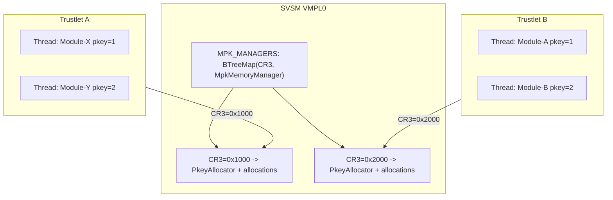

# Phase 3b v1.2: Per-Process MPK Manager

## 目标

将 SVSM 的 `MPK_MANAGER` 从全局单例（所有进程共享 15 个 pkey）改为 per-process 管理（每个进程独立 15 个 pkey），为后续多线程版本做好准备。

## 核心问题

当前 [`mpk_memory.rs`](svsm/kernel/src/process_manager/mpk_memory.rs) 第 163 行：

```rust
static MPK_MANAGER: SpinLock<MpkMemoryManager> = SpinLock::new(MpkMemoryManager::new());
```

所有进程共享一个 `PkeyAllocator` 位图，意味着整个 VM 只有 15 个可用 pkey。如果有 3 个 WAMR 进程各需 5 个函数模块，就会用完。

## 设计方案：BTreeMap<u64, MpkMemoryManager>

使用 CR3（页表基址）作为 key，为每个进程维护独立的 `MpkMemoryManager`（包含独立的 `PkeyAllocator` 位图和 `allocations` 表）。



## 修改范围

### 1. SVSM 侧：[`mpk_memory.rs`](svsm/kernel/src/process_manager/mpk_memory.rs)

**核心改动：**

- 将全局 `static MPK_MANAGER` 改为 `static MPK_MANAGERS: SpinLock<BTreeMap<u64, MpkMemoryManager>>`
- 每个 API 函数根据 `page_table_cr3` 参数自动查找或创建对应进程的 `MpkMemoryManager`
- `MpkMemoryManager::new()` 不再需要 `const fn`（因为不再用于 static 初始化），改为用 `BTreeMap::new()` 初始化全局 map

**API 签名保持不变**（向后兼容）：

| 函数 | 参数变化 | 行为变化 |

|------|----------|----------|

| `mpk_pkey_alloc_only()` | 需新增 `cr3: u64` 参数 | 从对应进程的位图分配 |

| `mpk_alloc_memory(cr3, addr, size, pkey)` | 不变 | 从对应进程的 allocations 表记录 |

| `mpk_free_memory(cr3, addr, size)` | 不变 | 从对应进程的 allocations 表查找 |

| `mpk_free_pkey(pkey, cr3, addr, size)` | 不变 | 从对应进程的位图释放 |

`mpk_pkey_alloc_only()` 是唯一需要修改签名的函数，需要新增 `cr3` 参数以定位进程。

### 2. SVSM 侧：[`runtime.rs`](svsm/kernel/src/process_runtime/runtime.rs)

- `pal_svsm_mpk_pkey_alloc` (第 580 行)：调用 `mpk_pkey_alloc_only` 时传入 `self.vmsa.cr3`
- 其他 MPK 接口已经传入 `self.vmsa.cr3`，无需修改

### 3. VMPL1 侧 (wamr-pal)：无需修改

六接口协议（CPUID 调用号、寄存器传参）完全不变。VMPL1 不感知 SVSM 内部是全局还是 per-process 管理。

### 4. test_wamr.py：无需修改

Phase 3b v1.0 的测试流程完全兼容。

## 关键实现细节

**进程 Manager 的惰性创建**：首次调用 `mpk_pkey_alloc_only(cr3)` 时，若 `MPK_MANAGERS` 中没有该 CR3 的条目，自动创建一个新的 `MpkMemoryManager` 并插入。

**进程清理**：可选新增 `mpk_cleanup_for_process(cr3)` 函数，在 `TrustedProcess::Drop` 时调用，移除该 CR3 对应的整个 `MpkMemoryManager` 条目。Phase 3b v1.0 已有 shutdown 信号通过 `mpk_free_pkey` 逐个清理，此函数作为安全网。但鉴于 Phase 3b v2.0 的 Drop 修改曾导致卡死问题，**v1.2 暂不修改 `process.rs` 的 Drop 实现**，仅依赖 VMPL1 侧的 shutdown 信号清理。

## 验证方式

1. 编译 SVSM：`nix develop` + `make build_svsm`
2. 编译 wamr-pal：`cd wamr-pal && make clean && make && make deploy`（实际无需重新编译，因为 VMPL1 侧无改动）
3. 运行测试：`python3 test_wamr.py` 应与 Phase 3b v1.0 行为完全一致