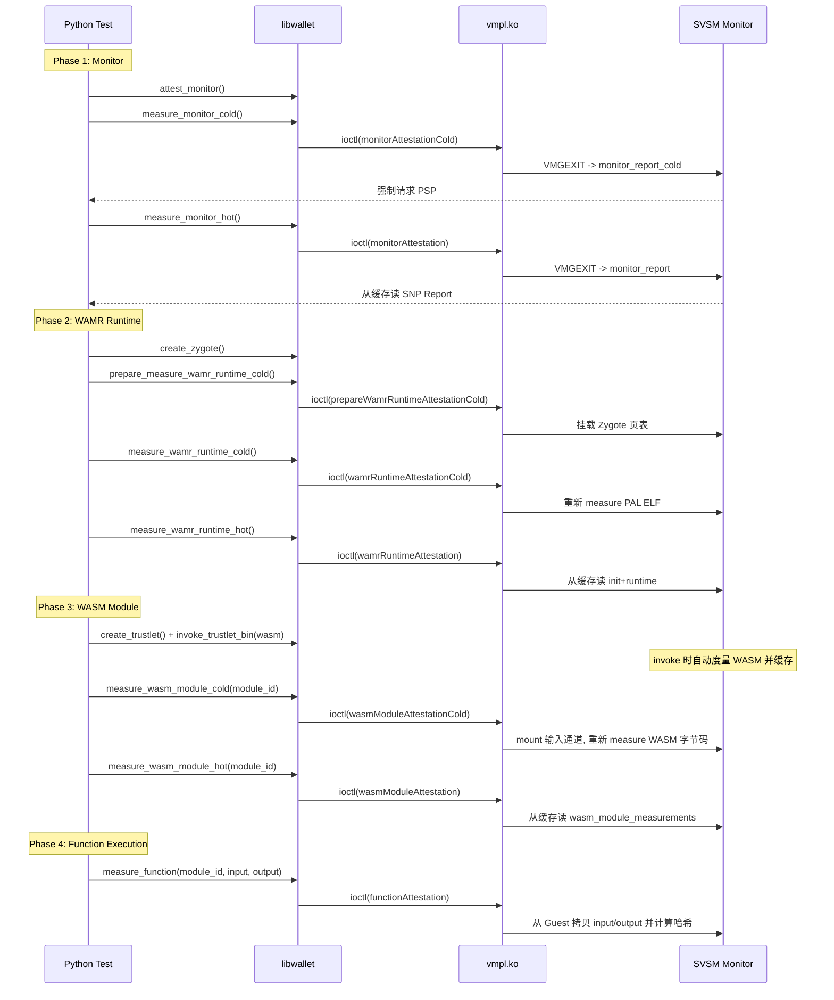

# Phase 4 v2.0: Microbenchmark 适配方案

## 核心设计思路

将原版 7 种 microbenchmark 操作映射为新架构：

| 原 Wallet | Phase 4 v2.0 | 变化说明 |

|-----------|-------------|----------|

| `measure_monitor_cold` | `measure_monitor_cold` | 不变 |

| `measure_monitor_hot` | `measure_monitor_hot` | 不变 |

| `prepare_measure_zygote_cold` + `measure_zygote_cold` | `prepare_measure_wamr_runtime_cold` + `measure_wamr_runtime_cold` | 重命名，逻辑基本复用 |

| `measure_zygote_hot` | `measure_wamr_runtime_hot` | 重命名，复用 `wamrRuntimeAttestation` 热路径 |

| `prepare_measure_trustlet_cold` + `measure_trustlet_cold` | `measure_wasm_module_cold` (无 prepare) | **重新设计**：直接 mount 输入通道重新度量 WASM 字节码 |

| `measure_trustlet_hot` | `measure_wasm_module_hot` | 复用 `wasmModuleAttestation` 热路径，需传 `module_id` |

| `measure_function` | `measure_function` | 新增 `module_id` 参数 |

### WASM Module 冷启动的关键区别

原版 Trustlet 冷启动需要 prepare（挂载 Trustlet 的 function 页表到 Monitor），因为 function code 存储在 Trustlet 独立的页表区域。

你的 WASM Module 冷启动**不需要 prepare**，因为 WASM 字节码存储在 Trustlet 的输入通道（`trustlet.context.channel.input`）中，SVSM 可以直接 `mount()` 访问。冷启动操作是：mount 输入通道 -> 解析 Phase 3b header -> 对 wasm_bytes 做 SHA-512 -> 组装报告。

## 枚举值变更

[module/include/vmpl.h](module/include/vmpl.h) 中的 `attestation_report_type`：

```c
/* helper attestation options for microbenchmarks */
monitorAttestationCold = 4,
prepareWamrRuntimeAttestationCold = 5,  // 原 prepareZygoteAttestationCold
wamrRuntimeAttestationCold = 6,         // 原 zygoteAttestationCold
wasmModuleAttestationCold = 7,          // 原 trustletAttestationCold (不再需要 prepare)
// prepareTrustletAttestationCold 删除（不再需要）
```

注意：原来有 5 个 microbenchmark 枚举值（4-8），现在变为 4 个（4-7），因为 WASM Module 冷启动不需要 prepare 步骤。`maxAttestationReportType` 的值会自动调整。

## 各文件修改清单

### 1. SVSM 侧: [monitor.rs](svsm/kernel/src/attestation/monitor.rs)

**常量重命名**（第 64-68 行）：

```rust
pub const MONITOR_ATTESTATION_COLD: u64 = 4;
const PREPARE_WAMR_RUNTIME_ATTESTATION_COLD: u64 = 5;
const WAMR_RUNTIME_ATTESTATION_COLD: u64 = 6;
const WASM_MODULE_ATTESTATION_COLD: u64 = 7;
// 删除 PREPARE_TRUSTLET_ATTESTATION_COLD 和 TRUSTLET_ATTESTATION_COLD
```

**`diff_attestation` 分发器**（第 403-424 行）：

- 重命名 case 分支
- 删除 `PREPARE_TRUSTLET_ATTESTATION_COLD` 分支
- 将 `TRUSTLET_ATTESTATION_COLD` 替换为 `WASM_MODULE_ATTESTATION_COLD`，调用新函数 `wasm_module_report_cold`

**重命名函数**：

- `prepare_zygote_report_cold` -> `prepare_wamr_runtime_report_cold`（逻辑基本不变）
- `zygote_report_cold` -> `wamr_runtime_report_cold`（逻辑基本不变）
- 删除 `prepare_trustlet_report_cold`
- `trustlet_report_cold` -> **新写** `wasm_module_report_cold`

**`wasm_module_report_cold` 新实现**（替代 `trustlet_report_cold`）：

```rust
fn wasm_module_report_cold(params: &mut RequestParams) -> Result<(), SvsmReqError> {
    let trustlet_id = ProcessID(params.r8 as usize);
    let module_id = params.r9 as usize;
    let trustlet = PROCESS_STORE.get(trustlet_id);

    let init_measurement = trustlet.measurements.init_measurement;
    let runtime_measurement = trustlet.measurements.runtime_measurement;

    // 冷启动：mount 输入通道，重新解析 header 并度量 WASM 字节码
    trustlet.context.channel.input.mount();
    let input_base = ALLOCATION_RANGE_VIRT_START as *const u8;
    let wasm_size = unsafe { *(input_base as *const u32) } as u64;
    let wasm_module_measurement = if wasm_size > 0 {
        // 解析 header 计算 offset（与 runtime.rs 中的逻辑相同）
        let func_name_len = unsafe { *(input_base.add(4) as *const u32) } as u64;
        let argc = unsafe { *(input_base.add(8) as *const u16) } as u64;
        let mut offset = 12u64 + func_name_len;
        offset = (offset + 3) & !3;
        offset += argc * 4;
        measure(ALLOCATION_RANGE_VIRT_START + offset, wasm_size)
    } else {
        [0u8; HASH_SIZE]
    };
    trustlet.context.channel.input.unmount();

    // 组装报告：SNP + init + runtime + wasm_module
    let mut new_report: Vec<u8> = Vec::new();
    // ... (与 wasm_module_report 相同的报告组装逻辑)
}
```

### 2. Guest 内核模块: [vmpl.h](module/include/vmpl.h)

枚举更新（第 44-48 行）：

```c
monitorAttestationCold = 4,
prepareWamrRuntimeAttestationCold = 5,
wamrRuntimeAttestationCold = 6,
wasmModuleAttestationCold = 7,
```

### 3. Guest 内核模块: [vmpl.c](module/src/vmpl.c)

`diff_attestation` switch（第 83-92 行）：

```c
case monitorAttestationCold:
    break;
case prepareWamrRuntimeAttestationCold:
case wamrRuntimeAttestationCold:
    call.r8 = mcall->monitor_attestation.process_id;
    break;
case wasmModuleAttestationCold:
    call.r8 = mcall->monitor_attestation.process_id;
    call.r9 = mcall->monitor_attestation.module_id;
    break;
```

### 4. C 头文件: [attest_microbenchmark.h](module/libwallet/src/attest_microbenchmark.h)

```c
void measure_monitor_cold();
void measure_monitor_hot();
void prepare_measure_wamr_runtime_cold(const uint64_t process_id);
void measure_wamr_runtime_cold(const uint64_t process_id);
void measure_wamr_runtime_hot(const uint64_t process_id);
void measure_wasm_module_cold(const uint64_t process_id, const uint64_t module_id);
void measure_wasm_module_hot(const uint64_t process_id, const uint64_t module_id);
void measure_function(const uint64_t process_id, const uint64_t module_id,
                      const char* input, const uint64_t input_len,
                      const char* output, const uint64_t output_len);
```

### 5. C 实现: [attest_microbenchmark.c](module/libwallet/src/attest_microbenchmark.c)

- `measure_monitor_cold/hot`：不变
- `prepare_measure_zygote_cold` -> `prepare_measure_wamr_runtime_cold`：重命名枚举值
- `measure_zygote_cold` -> `measure_wamr_runtime_cold`：重命名枚举值
- `measure_zygote_hot` -> `measure_wamr_runtime_hot`：使用 `wamrRuntimeAttestation`
- 删除 `prepare_measure_trustlet_cold`
- `measure_trustlet_cold` -> `measure_wasm_module_cold`：使用 `wasmModuleAttestationCold`，传 `module_id`
- `measure_trustlet_hot` -> `measure_wasm_module_hot`：使用 `wasmModuleAttestation`，传 `module_id`
- `measure_function`：新增 `module_id` 参数，填充 `function_data_ptr->moduleId`

### 6. Makefile: [libwallet/Makefile](module/libwallet/Makefile)

恢复编译 `attest_microbenchmark.c`：

```makefile
SRCS:=$(wildcard src/*.c)
```

### 7. pybind11 绑定: [main.cpp](module/python/src_ext/main.cpp)

取消注释并更新（第 74-93 行）：

```cpp
m.def("measure_monitor_cold", &measure_monitor_cold);
m.def("measure_monitor_hot", &measure_monitor_hot);
m.def("prepare_measure_wamr_runtime_cold", &prepare_measure_wamr_runtime_cold,
      py::arg("process_id"));
m.def("measure_wamr_runtime_cold", &measure_wamr_runtime_cold,
      py::arg("process_id"));
m.def("measure_wamr_runtime_hot", &measure_wamr_runtime_hot,
      py::arg("process_id"));
m.def("measure_wasm_module_cold", &measure_wasm_module_cold,
      py::arg("process_id"), py::arg("module_id"));
m.def("measure_wasm_module_hot", &measure_wasm_module_hot,
      py::arg("process_id"), py::arg("module_id"));
m.def("measure_function", &measure_function, py::arg("process_id"),
      py::arg("module_id"), py::arg("input"), py::arg("input_len"),
      py::arg("output"), py::arg("output_len"));
```

### 8. Python 类: [\_\_init\_\_.py](module/python/wallet/__init__.py)

**`Wallet` 类**：`measure_monitor_cold/hot` 不变

**`Zygote` 类**（重命名）：

```python
def prepare_measure_wamr_runtime_cold(self):
    _w.prepare_measure_wamr_runtime_cold(self.process_id)

def measure_wamr_runtime_cold(self):
    _w.measure_wamr_runtime_cold(self.process_id)

def measure_wamr_runtime_hot(self):
    _w.measure_wamr_runtime_hot(self.process_id)
```

**`Trustlet` 类**（新增 WASM Module + 更新 Function）：

```python
def measure_wasm_module_cold(self, module_id: int = 0):
    _w.measure_wasm_module_cold(self.process_id, module_id)

def measure_wasm_module_hot(self, module_id: int = 0):
    _w.measure_wasm_module_hot(self.process_id, module_id)

def measure_function(self, module_id: int, input, input_len, output, output_len):
    _w.measure_function(self.process_id, module_id, input, input_len, output, output_len)
```

### 9. 测试脚本: attest_microbenchmark.py

原本wallet-vmpl的测试文件保留，新建一个attest_microbenchmark.py测试流程：

```python
results = {
    "measure_monitor_cold": [],
    "measure_monitor_hot": [],
    "measure_wamr_runtime_cold": [],
    "measure_wamr_runtime_hot": [],
    "measure_wasm_module_cold": [],
    "measure_wasm_module_hot": [],
    "measure_function": {size: [] for size in fn_in_out_sizes},
}

for _ in range(repeats):
    with wallet.Wallet() as w:
        w.attest_monitor()
        # Monitor
        results["measure_monitor_cold"].append(time_function(w.measure_monitor_cold))
        results["measure_monitor_hot"].append(time_function(w.measure_monitor_hot))
        # Create Zygote
        zy = w.create_zygote(zygote, manifest, libos)
        zy.prepare_measure_wamr_runtime_cold()
        results["measure_wamr_runtime_cold"].append(time_function(zy.measure_wamr_runtime_cold))
        results["measure_wamr_runtime_hot"].append(time_function(zy.measure_wamr_runtime_hot))
        # Create Trustlet + invoke (load WASM module)
        tr = zy.create_trustlet(dummy_function)
        input_data = pack_input_load_and_invoke(wasm_bytes, "add", [3, 5])
        tr.invoke_trustlet_bin(input_data, OUTPUT_SIZE)
        module_id = 0  # 第一个加载的模块
        # WASM Module (无 prepare)
        results["measure_wasm_module_cold"].append(
            time_function(lambda: tr.measure_wasm_module_cold(module_id)))
        results["measure_wasm_module_hot"].append(
            time_function(lambda: tr.measure_wasm_module_hot(module_id)))
        # Function
        for size in fn_in_out_sizes:
            fn_input = os.urandom(size)
            fn_output = os.urandom(size)
            results["measure_function"][size].append(
                time_function(lambda: tr.measure_function(
                    module_id, fn_input, len(fn_input), fn_output, len(fn_output))))
        # Shutdown
        tr.invoke_trustlet_bin(pack_shutdown_signal(), OUTPUT_SIZE)
```

## 测试流程时序图

