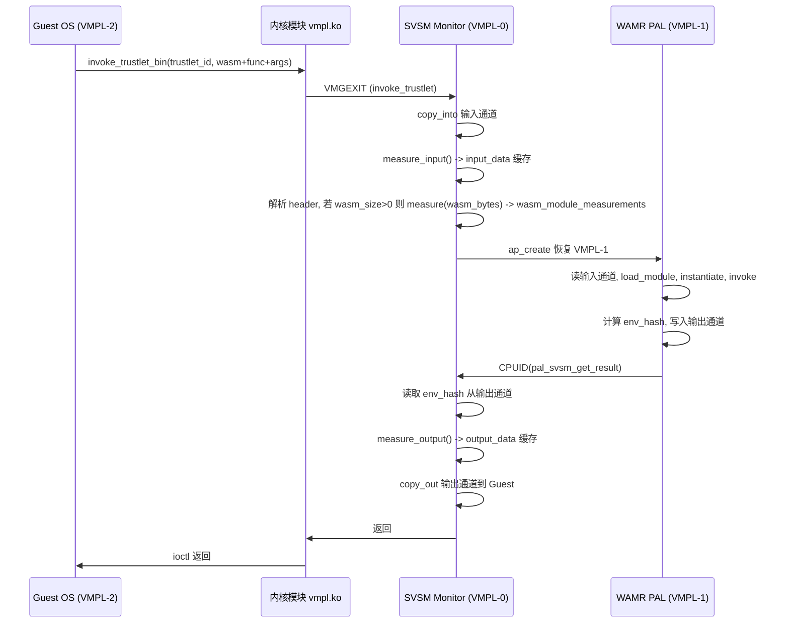

# Phase 4：差分认证实现方案

## 一、认证架构总览

将 Wallet 原版的 4 级差分认证适配为你的 WAMR 架构：

| 级别 | 类型 ID (`rdx`) | 报告内容 | 度量时机 |

|------|-----------------|----------|----------|

| 0 - Monitor 认证 | `rdx=0` | SNP Report（缓存） | 按需，首次调用 PSP，后续复用缓存 |

| 1 - WAMR Runtime 认证 | `rdx=1` | SNP + `init_measurement` + `runtime_measurement` | 按需，度量值在 `create_zygote` 时已缓存 |

| 2 - WASM Module 认证 | `rdx=2` | SNP + init + runtime + `wasm_module_measurements[module_id] `| 每次 `invoke_trustlet_bin` 加载新模块时自动度量 |

| 3 - 函数执行认证 | `rdx=3` | 以上全部 + `env_hash` + `input_hash` + `output_hash` | 用户调用 `attest_execution()` 时按需生成 |

```mermaid
flowchart TB
    subgraph level0 [Level 0: Monitor]
        SNP["SNP Report (PSP 硬件签名)"]
    end
    subgraph level1 [Level 1: WAMR Runtime]
        SNP2["SNP Report"] --> INIT["init_measurement (PAL ELF)"]
        INIT --> RT["runtime_measurement (WAMR Runtime)"]
    end
    subgraph level2 [Level 2: WASM Module]
        SNP3["SNP Report"] --> INIT2["init_measurement"]
        INIT2 --> RT2["runtime_measurement"]
        RT2 --> MOD["wasm_module_measurements (module_id)"]
    end
    subgraph level3 [Level 3: Function Execution]
        SNP4["SNP Report"] --> INIT3["init + runtime + module"]
        INIT3 --> ENV["env_hash (实例化环境)"]
        ENV --> IN["input_hash (函数输入)"]
        IN --> OUT["output_hash (函数输出)"]
        OUT --> SIG["Ed25519 签名"]
    end
```



## 二、核心设计决策

### 2.1 两套度量机制的分工

Wallet 项目中存在**两套独立的度量机制**，我们各取所长：

**机制 A — 运行时自动度量**（[runtime.rs:271](svsm/kernel/src/process_runtime/runtime.rs) 和 [runtime.rs:817](svsm/kernel/src/process_runtime/runtime.rs)）：

- `invoke_trustlet` NORMAL 路径中，SVSM 将 Guest 数据拷贝到输入通道后，自动对**整个输入通道**做 SHA-512
- `pal_svsm_get_result` 中，SVSM 在拷贝输出通道回 Guest 后，自动对**整个输出通道**做 SHA-512
- 哈希值缓存在 `ProcessMeasurements.input_data` / `output_data` 中，每次 invoke 时覆盖

**用途**：我们在机制 A 的位置**新增 WASM 模块度量逻辑**——解析输入通道 header，单独对 WASM 字节码部分做哈希。

**机制 B — 按需认证报告**（[monitor.rs:296](svsm/kernel/src/attestation/monitor.rs) 的 `function_report`）：

- 用户调用 `attest_execution()` 时，传入原始 input/output 指针
- SVSM 从 Guest 内存重新拷贝原始数据并计算哈希
- 组装完整认证报告（SNP + 所有度量 + 签名）

**用途**：保留此方式用于**函数执行认证**，度量的是用户指定的纯粹函数输入/输出数据，语义清晰。

### 2.2 WASM 模块度量时机与方法

**时机**：在 `invoke_trustlet()` 的 NORMAL 路径中（[runtime.rs:260-274](svsm/kernel/src/process_runtime/runtime.rs)），在现有的 `measure_input()` 之后，新增 WASM 模块度量逻辑。

**方法**：SVSM 挂载（mount）输入通道后，解析 Phase 3b 的输入通道协议 header：

```
[0..3]   uint32_t wasm_size       // > 0 表示 Mode 1（加载新模块）
[4..7]   uint32_t func_name_len
[8..9]   uint16_t argc
[10..11] uint16_t reserved
[12..12+func_name_len-1] func_name
[aligned to 4] argv[argc]
[offset..offset+wasm_size-1] wasm_bytes   // <-- 对这部分做 SHA-512
```

如果 `wasm_size > 0`（Mode 1），则：

1. 计算 WASM 字节码在输入通道中的偏移量
2. 对 `wasm_bytes` 部分单独做 `measure()` 得到 SHA-512 哈希
3. 存入 `trustlet.measurements.wasm_module_measurements[wasm_module_count]`
4. `wasm_module_count += 1`

这一切发生在 **VMPL-0 侧**，在 VMPL-1 恢复执行之前，安全性有保证。



### 2.3 函数实例化环境哈希 (env_hash)

`wasmlet_invoke()` 中的 `inst`（`wasm_module_inst_t`）和 `exec_env`（`wasm_exec_env_t`）是**临时对象**，在函数调用结束后立即销毁（[wasmlet_vmpl1.c:288-296](wamr-pal/wasmlet_vmpl1.c)）。VMPL-0 无法直接访问 VMPL-1 的堆内存。

**方案**：由 VMPL-1 在实例化完成后、函数调用之前，计算环境哈希并写入输出通道的固定偏移位置。SVSM 在 `pal_svsm_get_result()` 中从输出通道读取此哈希。

在 `wasmlet_invoke()` 的第 2 步（创建 exec_env 之后、调用函数之前）插入：

```c
// 计算实例化环境的摘要信息
struct env_snapshot {
    uint64_t linear_mem_base;   // 线性内存基址
    uint32_t linear_mem_size;   // 线性内存大小
    uint32_t stack_size;        // WASM 栈大小
    uint32_t heap_size;         // WASM 堆大小
    uint32_t global_count;      // 全局变量数量
};
// 对 env_snapshot 做 SHA-512 -> 64 字节 hash
// 写入输出通道偏移 8 处（status=4B + result=4B 之后）
```

输出通道新布局：

```
[0..3]   uint32_t status
[4..7]   uint32_t result
[8..71]  uint8_t  env_hash[64]   // 新增：实例化环境哈希
```

SVSM 在 `pal_svsm_get_result()` 中，在 `measure_output()` 之前，先从输出通道偏移 8 处读取 64 字节的 `env_hash`，存入 `ProcessMeasurements.env_hash`。

**安全性说明**：虽然 env_hash 由 VMPL-1 计算，但 VMPL-1 运行在 SEV-SNP 硬件保护下，其代码完整性已由 `init_measurement` 保证。VMPL-0 可以通过对比 `wasm_module_measurements` 来交叉验证环境合理性。

### 2.4 Zygote 创建时的度量适配

当前 [process_cow.rs](svsm/kernel/src/process_manager/process/process_cow.rs) 的 `TrustedProcess::zygote()` 度量三个组件：PAL、Manifest、LibOS。在 Phase 3b 中，Manifest 和 LibOS 是 dummy 文件。

**适配方案**：

- `init_measurement` = PAL ELF 的 SHA-512（不变，复用原有 `measure(pal_data, pal_size)`）
- `runtime_measurement` = Manifest 数据的 SHA-512（复用原有 `manifest_measurement` 的位置，但语义变为"WAMR runtime 配置"）
- 删除 `libos_measurement`（或保留为全零占位）

由于 Phase 3b 的 PAL ELF 本身**包含了 WAMR runtime 代码**（静态链接），所以 `init_measurement` 实际上已经覆盖了 WAMR runtime。`runtime_measurement` 可以用来度量 Manifest/配置文件，或在未来用于度量动态加载的 runtime 组件。

### 2.5 ProcessMeasurements 结构体

```rust
pub const MAX_WASM_MODULES: usize = 15;

#[derive(Debug, Copy, Clone)]
pub struct ProcessMeasurements {
    pub init_measurement: [u8; 64],           // WAMR PAL ELF 哈希
    pub runtime_measurement: [u8; 64],        // WAMR Runtime 配置哈希（原 manifest 位置）
    pub wasm_module_measurements: [[u8; 64]; MAX_WASM_MODULES],  // 每个模块的哈希
    pub wasm_module_count: usize,             // 已加载模块数量
    pub env_hash: [u8; 64],                   // 函数实例化环境哈希
    pub input_data: [u8; 64],                 // 输入通道哈希（自动缓存）
    pub output_data: [u8; 64],                // 输出通道哈希（自动缓存）
}
```

## 三、各层认证报告的组装逻辑

### 3.1 Monitor 认证 (type=0)

不变，复用 Wallet 原版 `monitor_report()`。首次调用 PSP 获取 SNP Report 并缓存。

### 3.2 WAMR Runtime 认证 (type=1)

替换原 `zygote_report()`：

```rust
fn wamr_runtime_report(params) {
    let process = PROCESS_STORE.get(process_id);
    let mut report = Vec::new();
    report.extend(cached_snp_report);
    report.extend(process.measurements.init_measurement);      // PAL ELF
    report.extend(process.measurements.runtime_measurement);   // Runtime 配置
    copy_back_report(report);
}
```

### 3.3 WASM Module 认证 (type=2)

替换原 `trustlet_report()`，新增 `module_id` 参数：

```rust
fn wasm_module_report(params) {
    let process = PROCESS_STORE.get(process_id);
    let module_id = params.r9 as usize;
    let mut report = Vec::new();
    report.extend(cached_snp_report);
    report.extend(process.measurements.init_measurement);
    report.extend(process.measurements.runtime_measurement);
    report.extend(process.measurements.wasm_module_measurements[module_id]);
    copy_back_report(report);
}
```

### 3.4 函数执行认证 (type=3)

修改原 `function_report()`，新增 `moduleId` 和 `env_hash`：

```rust
fn function_report(params) {
    // 从 function_data 结构体提取参数（包括新增的 moduleId）
    let module_id = function_data_struct[1];  // 新增字段
    let process = PROCESS_STORE.get(trustlet_id);

    // 从 Guest 内存拷贝原始 input/output 并计算哈希（保留原版方式）
    let input_hash = measure(copy_from_guest(fn_input_addr));
    let output_hash = measure(copy_from_guest(fn_output_addr));

    let mut report = Vec::new();
    report.extend(cached_snp_report);
    report.extend(process.measurements.init_measurement);
    report.extend(process.measurements.runtime_measurement);
    report.extend(process.measurements.wasm_module_measurements[module_id]);
    report.extend(process.measurements.env_hash);       // 新增
    report.extend(input_hash);
    report.extend(output_hash);
    report.extend(sign_report(&report));
    copy_back_report(report);
}
```

## 四、Guest 侧修改

### 4.1 vmpl.h 枚举更新

```c
enum attestation_report_type {
    monitorAttestation = 0,
    wamrRuntimeAttestation = 1,     // 原 zygoteAttestation
    wasmModuleAttestation = 2,      // 原 trustletAttestation
    functionAttestation = 3,        // 不变
    /* 微基准测试类型暂不修改 */
    monitorAttestationCold = 4,
    // ...
    maxAttestationReportType,
};
```

### 4.2 monitor_call 结构体更新

在 `monitor_attestation` 匿名结构体中新增 `module_id` 字段：

```c
struct /* monitor attestation */ {
    void* address;
    uint64_t process_id;
    void* function_data_ptr;
    uint64_t module_id;                    // 新增：WASM Module 认证时指定模块 ID
    enum attestation_report_type type;
} monitor_attestation;
```

### 4.3 vmpl.c diff_attestation switch 更新

```c
case monitorAttestation:
    break;
case wamrRuntimeAttestation:
    // 只需 process_id，和原 zygoteAttestation 相同
    call.r8 = mcall->monitor_attestation.process_id;
    break;
case wasmModuleAttestation:
    // 需要 process_id + module_id
    call.r8 = mcall->monitor_attestation.process_id;
    call.r9 = mcall->monitor_attestation.module_id;
    break;
case functionAttestation:
    // 保留原版：传递 Guest 页表 + function_data 指针
    call.r8 = get_pgd_phys();
    call.r9 = mcall->monitor_attestation.function_data_ptr;
    break;
```

### 4.4 Field 数组更新

根据认证级别不同，报告中包含的字段不同。Field 数组定义了**最完整的报告布局**（Level 3），低级别的报告只填充前几个字段：

```c
// SNP Report 标准字段 (0x00 - 0x4A0) 不变
// Wallet 差分认证扩展字段：
{"INIT_MEASUREMENT",           0x4A0, 64},   // PAL ELF 哈希
{"RUNTIME_MEASUREMENT",        0x4E0, 64},   // WAMR Runtime 配置哈希
{"WASM_MODULE_MEASUREMENT",    0x520, 64},   // 指定 module_id 的模块哈希
{"ENV_HASH",                   0x560, 64},   // 函数实例化环境哈希
{"FUNCTION_INPUT_MEASUREMENT", 0x5A0, 64},   // 函数输入数据哈希
{"FUNCTION_OUTPUT_MEASUREMENT",0x5E0, 64},   // 函数输出数据哈希
{"WALLET_SIGNATURE",           0x620, 64}    // Ed25519 签名
```

各级别报告填充情况：

- Level 1 (WAMR Runtime): 填充到 `RUNTIME_MEASUREMENT`（0x520 处结束）
- Level 2 (WASM Module): 填充到 `WASM_MODULE_MEASUREMENT`（0x560 处结束）
- Level 3 (Function Exec): 填充全部字段 + 签名

### 4.5 function_data 结构体更新

```c
typedef struct PACKED _function_data {
    uint64_t trustletId;    // 8 bytes — 进程 ID
    uint64_t moduleId;      // 8 bytes — 新增：要认证的模块 ID
    uint64_t fnInputSize;   // 8 bytes
    void* fnInput;          // 8 bytes — 用户原始输入数据指针
    uint64_t fnOutputSize;  // 8 bytes
    void* fnOutput;         // 8 bytes — 用户原始输出数据指针
    void* reportOutput;     // 8 bytes
} function_data;
```

对应 SVSM 侧 `function_report` 中的解析：

```rust
let trustlet_id   = function_data_struct[0];
let module_id     = function_data_struct[1];  // 新增
let fn_input_size = function_data_struct[2];  // 偏移 +1
let fn_input_addr = function_data_struct[3];  // 偏移 +1
let fn_output_size= function_data_struct[4];  // 偏移 +1
let fn_output_addr= function_data_struct[5];  // 偏移 +1
```

## 五、用户空间 API 更新

### 5.1 attest.h/c 新增函数

```c
// 新增：WAMR Runtime 认证
char* attest_wamr_runtime(const uint64_t process_id);

// 新增：WASM Module 认证
char* attest_wasm_module(const uint64_t process_id, const uint64_t module_id);

// 修改：函数执行认证（新增 module_id 参数）
char* attest_execution(const uint64_t process_id, const uint64_t module_id,
                       const char* input, const uint64_t input_len,
                       const char* output, const uint64_t output_len);
```

### 5.2 Python 绑定更新

[main.cpp](module/python/src_ext/main.cpp) 新增：

```cpp
m.def("attest_wamr_runtime", &attest_wamr_runtime, py::arg("process_id"));
m.def("attest_wasm_module", &attest_wasm_module, py::arg("process_id"), py::arg("module_id"));
// 更新 attest_execution 签名
```

[\_\_init\_\_.py](module/python/wallet/__init__.py) 新增方法到 `Trustlet` 类。

## 六、VMPL-1 侧修改

### 6.1 wasmlet_vmpl1.c env_hash 计算

在 `wasmlet_invoke()` 中，创建 `exec_env` 之后、调用函数之前，插入 env_hash 计算逻辑。

需要在 VMPL-1 侧实现一个简单的 SHA-512（可复用 WAMR 内部的 crypto 或自带一个轻量实现），或者通过 CPUID monitor call 请求 VMPL-0 帮忙计算。

**推荐方案**：新增一个 CPUID monitor call（如 `0x4FFFFFF4`），VMPL-1 将 env_snapshot 数据地址和大小通过寄存器传递给 VMPL-0，由 VMPL-0 的 `measure()` 函数计算哈希并存入 `ProcessMeasurements.env_hash`。这样哈希计算完全在 VMPL-0 侧完成，安全性更高。

## 七、需要修改的文件清单

| 文件 | 修改内容 |

|------|----------|

| [monitor.rs](svsm/kernel/src/attestation/monitor.rs) | `ProcessMeasurements` 结构体、认证常量、`wamr_runtime_report`、`wasm_module_report`、修改 `function_report`、`diff_attestation` 分发器 |

| [process_cow.rs](svsm/kernel/src/process_manager/process/process_cow.rs) | `zygote()` 度量适配（init + runtime）、删除 Trustlet 创建时的 function_measurement |

| [process_no_cow.rs](svsm/kernel/src/process_manager/process/process_no_cow.rs) | 同步 process_cow.rs 的改动 |

| [runtime.rs](svsm/kernel/src/process_runtime/runtime.rs) | `invoke_trustlet` NORMAL 路径新增 WASM 模块度量、`pal_svsm_get_result` 读取 env_hash、新增 env_hash monitor call handler |

| [vmpl.h](module/include/vmpl.h) | 枚举、`monitor_call` 结构体、`Field` 数组 |

| [vmpl.c](module/src/vmpl.c) | `diff_attestation` switch 语句 |

| [attest.h](module/libwallet/src/attest.h) | `function_data` 结构体、新增函数声明 |

| [attest.c](module/libwallet/src/attest.c) | 新增 `attest_wamr_runtime`、`attest_wasm_module`、修改 `attest_execution` |

| [wasmlet_vmpl1.c](wamr-pal/wasmlet_vmpl1.c) | env_hash 计算（通过 monitor call 或写入输出通道） |

| [main.cpp](module/python/src_ext/main.cpp) | pybind11 绑定新增 API |

| [\_\_init\_\_.py](module/python/wallet/__init__.py) | Python 类新增方法 |